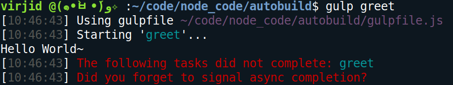
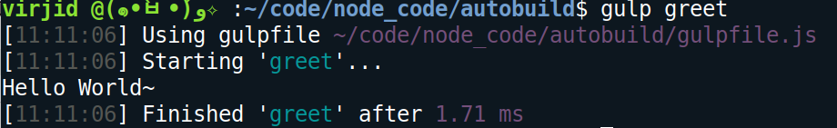
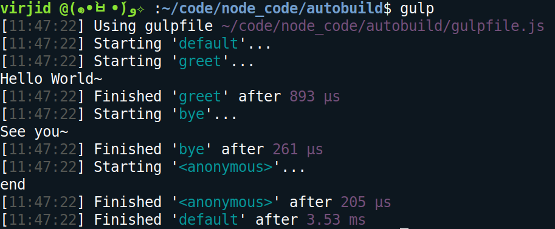
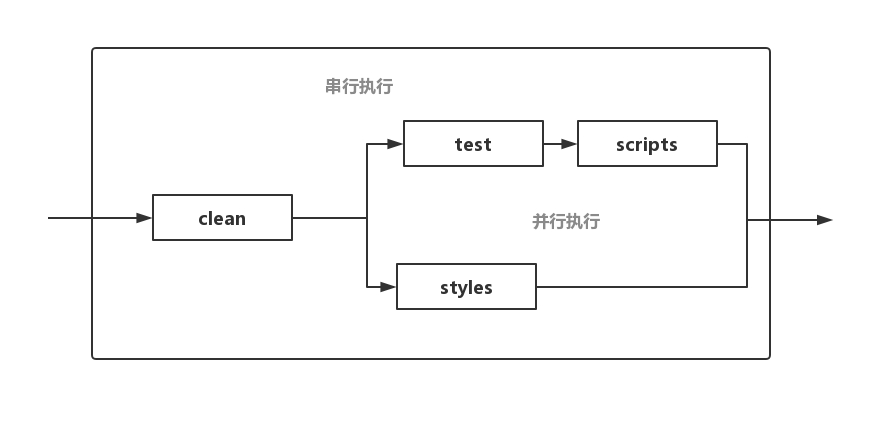

Gulp与Grunt一样，也是一个自动任务运行器。它充分借鉴了Unix操作系统的管道（pipe）思想，很多人认为，在操作上，它要比Grunt简单。
<!-- more -->

## Quick start
### Install
首先对Glup进行安装（下面的两条命令都需要执行）：
```
npm install -g gulp-cli

npm install --save-dev gulp
```

Gulp有一个 **全局安装的命令行接口`gulp-cli`** 和一个 **本地安装的`gulp`** 。其中本地gulp才是核心，它提供了所有的API并负责执行所有的构建任务，而命令行接口仅仅负责检查本地gulp并去启动它。

> 很多工具都会分别提供一个核心模块和一个命令行接口。命令行接口完全是为了便于用户使用工具，建议全局安装;而核心模块则是背后真正工作的程序，一般都会安装在本地。Gulp即使脱离了命令行接口也是可以运行的，你可以把它当作一个普通的Node模块来调用。

安装完Glup工具后，我们还需要根据具体的任务安装相应的Glup插件。比如，当我们需要压缩JS代码时，常常会用到`gulp-uglify`插件模块：
```
npm install --save-dev gulp-uglify
```

### Gulpfile.js
Glup安装完成后，在项目根目录下创建`glupfile.js`文件，它是Glup的配置文件，并且Gulp会去**自动**寻找它。一个简单的glupfile.js文件内容可以是这样的：
```javascript
var gulp = require('gulp'); // <- 加载gulp模块
var uglify = require('gulp-uglify'); // <- 加载插件

gulp.task('minify', ()=> { // <- 创建一个Gulp任务，一个Gulp任务相当于一个函数
  gulp.src('js/app.js')
    .pipe(uglify())
    .pipe(gulp.dest('build'))
});
```
上面代码中，gulpfile.js加载gulp和gulp-uglify模块之后，使用gulp模块的task方法指定任务minify。task方法有两个参数，第一个是任务名，第二个是任务函数。在任务函数中，使用gulp模块的src方法，指定所要处理的文件，然后使用pipe方法，将上一步的输出转为当前的输入，进行链式处理。

task方法的回调函数使用了两次pipe方法，也就是说做了两种处理。第一种处理是使用gulp-uglify模块，压缩源码；第二种处理是使用gulp模块的dest方法，将上一步的输出写入本地文件，这里是build.js（代码中省略了后缀名js）。

### Run
执行minify任务时，就在项目目录中执行下面命令就可以了。
```
$ gulp minify
```

## Gulp模块的基本方法
### src()
gulp模块的src方法，用于产生数据流。它的参数表示所要处理的文件，这些指定的文件会转换成数据流。参数的写法一般有以下几种形式。

- `js/app.js`：指定确切的文件名。
- `js/*.js`：某个目录所有后缀名为js的文件。
- `js/**/*.js`：某个目录及其所有子目录中的所有后缀名为js的文件。
- `!js/app.js`：除了js/app.js以外的所有文件。
- `*.+(js	css)`：匹配项目根目录下，所有后缀名为js或css的文件。

src方法的参数还可以是一个数组，用来指定多个成员。

```js
gulp.src(['js/**/*.js', '!js/**/*.min.js'])
```

### dest()
dest方法将管道的输出写入文件，同时将这些输出继续输出，所以可以依次调用多次dest方法，将输出写入多个目录。如果有目录不存在，将会被新建。
```javascript
gulp.src('./client/templates/*.jade')
  .pipe(jade())
  .pipe(gulp.dest('./build/templates'))
  .pipe(minify())
  .pipe(gulp.dest('./build/minified_templates'));
```
dest方法还可以接受第二个参数，表示配置对象。
```
gulp.dest('build', {
  cwd: './app',
  mode: '0644'
});
```
配置对象有两个字段。cwd字段指定写入路径的基准目录，默认是当前目录；mode字段指定写入文件的权限，默认是0777。

### task()
task方法用于定义具体的任务。它的第一个参数是任务名，第二个参数是任务函数。下面是一个非常简单的任务函数。

```js
gulp.task('greet',()=>console.log('Hello World~'));
```
执行greet任务时，终端屏幕上会出现类似于下面的情况：



图中红色警告说greet任务并没有完成，实际上是因为任务是异步执行的，并且greet任务在执行完成后并没有去告知gulp，导致gulp不知道任务已经完成了。

```js
gulp.task('greet',done=>{
   console.log('Hello World～');
   done();
});
```
gulp在执行任务时会将一个参数 **(即上面的done)** 注入到任务函数中，当我们调用done时就等价于在告知gulp该任务已经执行完毕：



> 调用异步函数时是不会出现阻塞情况的，所以通常异步执行的函数要在执行完成后告知调用者执行情况，然后调用者才能根据情况来做相应的处理。


如果一个任务的名字为default，就表明它是“默认任务”，在命令行直接输入gulp命令，就会运行该任务。


```js
gulp.task('default', ()=>{
  // Your default task
});
```

## 串行执行和并行执行
串行执行强调的是顺序，比如必须先执行完任务A才能再执行任务B;而并行执行的任务之间是没有先后顺序的。

### series
gulp使用series方法来定义一条顺序（串行）执行的执行链：
```js
gulp.task('greet', done=>{
   console.log('Hello World~');
   done();
});
gulp.task('bye', done=>{
    console.log('See you~');
    done();
});

gulp.task('default', gulp.series('greet','bye',done=>{
    console.log('end');
    done();
}));
```

> 需要注意串行执行链上的每个子任务都要告知gulp自己的执行情况，如果gulp不知道子任务的执行情况就无法继续执行下一个任务。串行执行链可以很好地控制任务之间的**依赖关系**，进而形成一条依赖链。

### parallel
gulp使用parallel方法来定义一条并行执行的执行链，只需要将`series`改为`parallel`即可。

### 串并行混合
假设我们的执行链有如下子任务：
- 清空所有编译结果  clean任务
- 编译ES6的代码 scripts任务
- ES6语法检查 test任务
- SCSS编译 styles任务

我们的任务链大致长这样：


