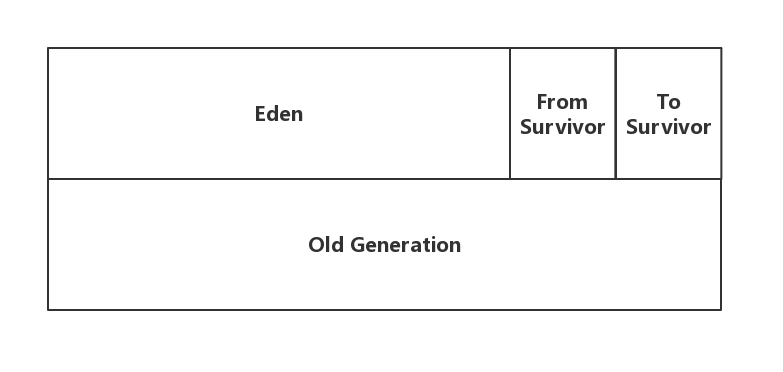

## 判断对象是否是“垃圾”

### 引用计数法

## Java堆

Java堆是垃圾收集器的重点关注区域，所以Java堆也常被称作**GC堆**。Java堆又被划分为不同的逻辑块：**新生代**与**老年代**。其中新生代又可以分为**Eden**、**From Survivor**、**To Survivor**。

```mermaid
graph TB
GC堆 --> 新生代
GC堆 --> 老年代
新生代 --> Eden
新生代 --> From_Survivor
新生代 --> To_Survivor
```

对内存的区域的划分应该是有其意义的，大多是为了方便管理、更好地回收内存以及更好地开辟内存。

## 垃圾收集算法

### 标记-清除算法

“标记-清除”算法与其名字一样，主要步骤分为：

1. 标记出所有需要回收的对象
2. 回收所有被标记的对象

如果采用标记-清除算法，清除之后的内存难免会变得杂乱无章。随着程序的运行，空闲的内存看似有很多，但不再是连续的。这有点像......GitHub的那张贡献日历图呀：

绿色的小格子代表正在被占用的内存空间，而灰色格子则代表空闲的内存。虽然灰色格子还有很多，**但大多数都不是连续的**。此时，那些空闲但不连续的内存放不下一个对象，便被沦为了**“内存碎片”**，造成了内存的浪费（类似于操作系统中的外部碎片，它属于内存碎片的一种）。

### 复制算法

为了解决效率问题，可以将内存分为两部分（A和B），其中一块内存A用来**按顺序**进行分配，无需考虑内存碎片等情况，一旦发现内存不够了，就把存活对象拷贝到内存B中，然后将A中的空间全部清理掉。

实际上在Java堆的新生代上，就采用类似于这样的算法，不过新生代不是分成两块而是三块，且**Eden : From_Survivor : To_Survivor = 8 : 1 : 1**。

由于Java中的大多数对象存活时间并不长，也就是所谓的“朝生夕死”，经过一轮垃圾回收后存活的对象数量不多。既然存活数量不多，那么复制操作就不会浪费太多的效率，所以复制算法就比较适合在新生代上使用。而且同样因为存活数量不多，但创建Java创建对象频繁，所以让Eden拥有较大比例的内存。

### 标记-整理算法

