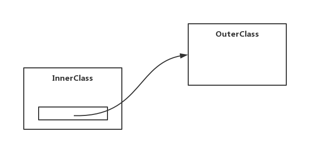

[TOC]

# 数据类型

## 1. 基本类型

基本类型又称为**原生类型 (primitive) **，它们在内存中直接保存相应的值。

Java 中的基本类型共有八种：

| 基本类型 | 大小    | 最小值           | 最大值                    |
| -------- | ------- | ---------------- | ------------------------- |
| boolean  | —       | —                | —                         |
| char     | 16 bits | Unicode 0        | Unicode 2<sup>16</sup> -1 |
| byte     | 8 bits  | -128             | +127                      |
| short    | 16 bits | - 2<sup>15</sup> | + 2<sup>15</sup> -1       |
| int      | 32 bits | - 2<sup>31</sup> | + 2<sup>31</sup> -1       |
| long     | 64 bits | - 2<sup>63</sup> | + 2<sup>63</sup> -1       |
| float    | 32 bits | IEEE754          | IEEE754                   |
| double   | 64 bits | IEEE754          | IEEE754                   |

<!-- Java 中数据是用补码存储的 -->

## 2. 引用类型

<!-- 引用类型 -->


## 3. 字面量

<!-- 字面量 -->


## 4. 包装类型

### 4.1 概览

有时候我们希望基本类型也具备对象的特性，因此就出现了包装类型，并且每一个基本类型都对应有一个包装类：

| 基本类型 | 包装类    |
| -------- | ------- |
| boolean  | Boolean |
| char     | Character |
| byte     | Byte |
| short    | Short     |
| int      | Integer |
| long   | Long      |
| float    | Float |
| double   | Double |


```java
Integer integer = new Integer(100);
```

<!-- 有一个比较特殊的包装类型叫作 Void -->

### 4.2 自动装箱与自动拆箱

将基本类型自动转为包装类型的过程称为**自动装箱**：

```java
Character character = 'a';
```

将包装类型自动转为基本类型的过程称为**自动拆箱**：

```java
Integer integer = 100; // 装箱
int num = integer;     //拆箱
```


### 4.3 注意空指针异常

:pensive: ​一旦使用了包装类，那就意味着有出现 NPE 的风险：

```java
Integer integer = null;
int a = integer; // NPE!
```


:confused: 千万**不能**先入为主地认为当包装类型变量的值为 null 时，在拆箱后会被自动转为 0 、空字符、0.0 之类的值！这是完全错误 :x: 的！


### 4.4 缓存池

当我们打开 Byte 类的源码时，我们能够看到 Byte 类里面有一个私有的静态内部类 **ByteCache** ：

```java
public final class Byte extends Number implements Comparable<Byte> {
    // ... 代码省略 ...

    private static class ByteCache {
        private ByteCache(){}  // 私有化构造器

        static final Byte cache[] = new Byte[-(-128) + 127 + 1]; // 数组大小为 256

        static {
            // 循环填充 cache 数组的每个位置
            for(int i = 0; i < cache.length; i++)
                cache[i] = new Byte((byte)(i - 128));
        }
    }

    // ... 代码省略 ...
}

```

将构造器私有化、类加载时就实例化 cache 字段、类加载时就将 cache 数组中的 256 个位置全部实例化为 Byte 对象 ... ... 

这意味着当 ByteCache 类被加载后：

- 整个 JVM 的内存中存在一个大小为 256 的数组 cache
- 整个 JVM 的内存中始终至少保存有 256 个 Byte 对象，它们的引用被 cache 数组管理着
- 这 256 个 Byte 对象对应的数值范围是 -128 ~ +127
-  :confused: ​**当我们想要使用 Byte 对象时不用再额外创建，直接从 cache 数组中取就可以了**


基本上每个包装类中都对应有这么一个 cache 数组用来缓存包装类的实例对象。各个包装类缓冲池的范围为下：

| 包装类名                      | 缓冲范围     |
| ----------------------------- | ------------ |
| Byte / Short / Integer / Long | -128 ~ +127  |
| Boolean                       | true / false |
| Character                     | 0 ~ 127      |
| Float                         | 无缓存       |
| Double                        | 无缓存       |

:confused: 自动装箱会去尝试使用缓存。​

具体的细节还应自行去查看相应的源代码。


### 4.5 何时从缓存池中取值

当我们调用包装类的 `valueOf` 静态方法时，就会从缓冲池 cache 中取得对象：

```java
public static void main(String[] args) {
	byte b = 1;

	Byte m = Byte.valueOf(b);
	Byte n = Byte.valueOf(b);

	System.out.println(m==n); // 输出 true
}
```

由于 m 、 n 的引用指向位于缓冲池中的同一个对象，所以最后就会输出 true。要记得的是，包装类的自动装箱实际上是调用了 `valueOf` 静态方法。


因为在 Java 中只要使用了 new 操作符就会新建一个对象，所以就会造成如下结果：

```java
public static void main(String[] args) {
	byte b = 1;
	Byte x = new Byte(b);
	Byte y = new Byte(b);

	System.out.println(x==y); // x 和 y 指向不同的对象，输出 false
}
```


另外，自动装箱会去尝试使用缓存：

```java
Integer a = 5;
Integer b = Integer.valueOf(5);

System.out.println(a == b) // true
```


## 5. 高精度数值

在 **java.math** 包下，java 提供了两种用来处理高精度的大数字类：`BigInteger` 和 `BigDecimal` ，他们通过牺牲了一定的速度（因为需要复杂的计算）来换取精度，这在很多场景都是值得的，比如交易系统。


高精度数值的计算不会发生溢出：

:pensive:

```java

// 发生溢出
System.out.println(1024 * 1024 * 1024 * 2); // -2147483648 即 -2^31 

```


:grin:

```java

BigInteger big_1024 = BigInteger.valueOf(1024);
BigInteger big_2 = BigInteger.valueOf(2);

BigInteger result =
    big_1024.multiply(big_1024).multiply(big_1024).multiply(big_2);

System.out.println(result); // 2147483648 即 1024*1024*1024*2 = 2^31

```


通常，我们可以使用字符串来构建高精度数值：

```java

BigInteger big = new BigInteger("FFFFFFFFFFFFFFFF", 16);
BigDecimal decimal = new BigDecimal(".33333333333");
double doubleNum = .33333333333;


// 18446744073709551615
System.out.println(big.toString());

// 0.1111111111088888888889
System.out.println(decimal.multiply(decimal).toString());

// 0.11111111110888888
System.out.println(doubleNum * doubleNum);

```


<!-- 高精度数值的一些 API 介绍 -->


## 6. 数组


# Java 中的字符串

## 1. 概览

在 Java 8 中，String 类的代码如下：

```java
public final class String
    implements java.io.Serializable, Comparable<String>, CharSequence {
    /** The value is used for character storage. */
    private final char value[];
    
    // ... 代码省略 ...
    
}
```

虽然字符串的使用频率非常高，甚至高过了大部分的原生类型，但 String 是一个引用类型这一事实是不可撼动的。初识字符串时我们往往将其理解为一个**字符数组**，代码中也确实有一个名为 value 的字符数组来保存字符串。在 Java 中，字符串的本质是一个 Unicode 字符序列。但不知道你是否有注意，value 字段被 final 所修饰，这意味着字符串的内容是不可变的。


:confused: 

- String 是引用类型，它可以为 null ，也可以用 new 来实例化对象

- String 被 final 修饰，所以 String 类不可被继承
- 字符串的本质就是一个 Unicode 字符序列
- Java 8 中，String 类的内部确实是使用字符数组来保存字符串的内容
- 世事无常，到了 Java 9 的版本后，String 使用 byte 数组来保存字符串的内容，或许这样更节省空间
- 无论是 Java 8 之前还是 Java 9 之后，字符串的内容都是不可变的！


## 2. 字符串基本概念

### 2.1 创建字符串

使用**双引号**将字符序列括起来即可创建一个字符串：

```java
String name = "Virjid";
```

因为String属于引用类型，所以也可以使用new运算符来创建字符串：

```java
String name = new String("Virjid");
```

直接使用双引号明显比 new 操作符显得方便得多，大多数情况下也确实使用前一种方式。

### 2.2 空串

空串是指不含任何字符的串：

```java
String empty = "";
```

### 2.3 空白串

由任意多个空白字符(通常指空格、制表符\\t、回车换行符\\n、\\r)的连续组合所得到的串称为空白串。

```java
String whitespace = " \t \t    \t";
```


:confused: 将空串与空白串等同起来是初学者常犯的错误。总得来说，空白串中是含有字符的，但空串是不含有任何字符的，只不过空白串中的字符通通不可见罢了。


:confused: ​另外，还会有人将空串 `""` 和 null 等同起来，这也是错误 :x: 的！空串虽然不含有任何字符，但确确实实是一个字符串对象，在内存中是占据一定空间的，但 null 则代表不存在的即不占据半点内存空间。


### 2.4 单字符串

只含有一个字符的串称为单字符串，但是需要注意单字符串不等同于字符：

```
String singleString = "a";
char singleChar = 'a';
// "a" ≠ 'a'
```

### 2.5 子串

串中任意个连续的字符组成的子序列称为该串的**子串**，Java 中可以使用成员方法 `substring` 来提取一个子串：

```java
String sayHello = "Hello World!";
String world = sayHello.substring(6, 11);

System.out.print(world); // world
```

> substring 方法的第一个参数表示从串的哪个位置**开始**提取子串，而第二个参数则表示**不想**提取的第一个字符位置。
>
> 对于 `s.substring(a, b)` 而言，**(b-a) 表示子串的长度**。

### 2.6 串的拼接

Java中可以使用加号(+) 来拼接两个字符串：

```java
String sayHello = "Hello" + " " + "world" + "!";

System.out.print(sayHello); // Hello world!
```


## 2. 不可修改的字符串

程序运行时，一个字符串就会占据一定的内存。所谓字符串不可被修改的意思是指：当分配一块存储空间用于存放某一个字符串后，Java 便不允许我们去重写该存储空间的值了。

如果我们想要对字符串 s1 进行修改，我们只能重新开辟一块存储空间（定义一个变量 s2 ）用来存放修改的结果，而 s1 的值并没有发生任何改变：

```java
String s1 = "hello";
String s2 = s1+" world";

System.out.println(s1); // hello
System.out.println(s2); // hello world

// 只能将拼接的结果存放在一个新的内存空间
```


## 3. 字符串常量池


## 4. 判断两个字符串是否相等


## 5. 码点与代码单元


## 6. 构建字符串


## 7. String API


## 8. String、StringBuilder 以及 StringBuffer

相对于直接使用 String 拼接字符串会很容易产生一大堆需要垃圾回收的中间对象，StringBuilder 和 StringBuffer 在拼接字符串方面显得更加高效。其原因在于它们（指 StringBuilder 和 StringBuffer）底层的字符序列是可变的，在拼接字符串时也就没有生成中间对象的必要了。

```java

StringBuilder builder = new StringBuilder();
builder.append("hello");
builder.append(123);
String str = builder.toString(); // "hello123"

```


StringBuilder 和 StringBuffer 的操作几乎一样，不过前者是线程不安全的，而后者是线程安全的。String 是线程安全的这很好理解，因为 String 底层的字符序列被 final 所修饰，也就是不可变，当然是线程安全的。对于 StringBuffer 而言，在必要的操作上都加上了 synchronized 修饰符，所以也是线程安全的，但运行效率势相对于 StringBuilder 会有所折扣。


总结一下：

**1. 可变性**

- String 不可变
- StringBuffer 和 StringBuilder 可变

**2. 线程安全**

- String 不可变，因此是线程安全的
- StringBuilder 不是线程安全的
- StringBuffer 是线程安全的，内部使用 synchronized 进行同步


# Java 异常机制

## 1. 概述

Java 将异常作为对象进行处理，并且定义一个基类 `java.lang.Throwable` 作为所有异常类的超类。

<center></center>
在 Throwable 下面显然出现了两条分支：`Error` 和 `Exception` 。

然后 Exception 下面又会有两条分支：`Unchecked Exception (RuntimeException)` 和 `Checked Exception`

## 2. Java 异常的体系结构

### 2.1 Error

`Error` 表示不希望被程序捕获或者是程序无法处理的错误，由 Java 虚拟机生成并抛出，大多数错误与代码编写者所执行的操作无关。例如，Java虚拟机运行错误（ `Virtual MachineError` ），当JVM不再有继续执行操作所需的内存资源时，将出现 `OutOfMemoryError`。这些异常发生时，Java 虚拟机（ JVM ）一般会选择线程终止；还有发生在虚拟机试图执行应用时，如类定义错误（ `NoClassDefFoundError` ）、链接错误（ `LinkageError` ）。这些错误是不可查的，因为它们在应用程序的控制和处理能力之外，而且绝大多数是程序运行时不允许出现的状况。对于设计合理的应用程序来说，即使确实发生了错误，本质上也不应该试图去处理它所引起的异常状况。在 Java 中，错误通常是使用 `Error` 的子类描述。


### 2.2 非受检异常（运行时异常）


### 2.3 受检异常（非运行时异常）


## 3. 异常的抛出与捕获

### 3.1 throw & throws


### 3.2 try ... catch ... finally


### 3.3 try-with-resources


### 3.4 异常链（栈）


## 4. 自定义异常


# Java 内部类

## 1. 关于内部类

顾名思义，内部类就是定义在一个类中的类。内部类除了可以像一般的类一样，继承超类、实现接口、访问自己的数据等等，还可以访问外部类的数据（包括私有数据）。

我们可以将某些内部类看作外部类的一个属性，一样可以使用访问修饰符来修饰且完全符合相应的规则。


## 2. 使用内部类访问对象状态

```java
public class OuterClass {
	private int a = 23;
	
	public class InnerClass {
		public void printA() {
			System.out.println(a);
		}
	}
}
```

内部类对象中有一个隐式引用指向外部类对象，就像上面的代码中，内部类对象中访问的**变量a**明显就是**外部类对象的属性**:



如果要在代码中显示地表达这种关系，则需要使用语法 **`外部类名.this`** ，它代表**调用当前方法的对象所对应的外部类对象**。

```java
public class OuterClass {
	private int a = 23;
	
	public class InnerClass {
		public void printA() {
			System.out.println(OuterClass.this.a);
		}
	}
}
```


## 3. 局部内部类

局部内部类是定义于代码块中的内部类，即其作用域就被限定在该代码块内，且不能使用访问修饰符来修饰。

```java
public class OuterClass {
	public void printInnerA() {
		class InnerClass {
			private String a = "Hello~";
			
			public void printA() {
				System.out.println(a);
			}
		}
		
		InnerClass innerClass = new InnerClass();
		innerClass.printA();
	}
	
	public static void main(String[] args) {
		OuterClass outerClass = new OuterClass();
		outerClass.printInnerA();
	}
}
```

对于一些临时且简单的类，则可以使用局部内部类来定义。另外，局部内部类除了可以访问外部类以外，还可以访问代码块中的局部变量。


## 4. 匿名内部类

当局部内部类要继承类或实现接口时，我们可以这样写

```java
public class OuterClass {
	public void startThread() {
		Runnable inner = new Runnable() {
			public void run() {
				System.out.println("running...");
			}
		};
		
		Thread thread = new Thread(inner);
		
		thread.start();
	}
	
	public static void main(String[] args) {
		OuterClass outerClass = new OuterClass();
		outerClass.startThread();
	}
}
```

还可以写得再简单一些：

```java
public void startThread() {

    Thread thread = new Thread(new Runnable() {
        public void run() {
            System.out.println("running...");
        }
    });

    thread.start();
}
```

甚至更简单一点：

```java
public void startThread() {

    new Thread(new Runnable() {
        public void run() {
            System.out.println("running...");
        }
    }).start();
}
```


## 5. 静态内部类

```java
public class ArrayAlg {
	public static class Pair {
		private double first;
		private double second;
		
		public Pair(double f, double s) {
			first = f;
			second = s;
		}
		
		public double getFirst() { return first; }
		public double getSecond() { return second; }
	}
	
	public static Pair minmax(double[] values) {
		double min = Double.POSITIVE_INFINITY;
		double max = Double.NEGATIVE_INFINITY;
		for (double v : values) {
			if (min > v) min = v;
			if (max < v) max = v;
		}
		return new Pair(min, max);
	}
	
	public static void main(String[] args) {
	    ArrayAlg.Pair pair = ArrayAlg.minmax(new double[] {1.32,32,43,43.21,-3.2});
	    System.out.println(pair.getFirst()+" "+pair.getSecond());
	}
}
```


## 6. 成员内部类

以实现一个链表为例子，链表的由结点构成，每个结点除了保存元素以外，还要保存指向下一个结点的地址。为了方便我们实现，我们可以文结点定义一个内部类。

```java

public class Link<Item> implements Iterable<Item> {
    private int size;
    private Node<Item> first;

    private class Node<Item> {
        private Item item;
        private Node next;
    }
    
   // ......
       
}
```


# Java 泛型

## 1. 什么是泛型？

**泛型** 就是参数化类型，即将类型也看作一种参数，Java 集合框架是频繁使用泛型的一个典型例子：

```java

List<File> fileList = new ArrayList<File>();

List<String> stringList = new ArrayList<String>();

```

上面在尖括号里面的东西便是**类型参数**，fileList 表示只存放 File 对象的列表，而 stringList 很明显只存放字符串。


## 2. 泛型类型擦除

泛型类型只有在**静态类型检查期间**才出现，在此之后，程序中的所有泛型类型都将被擦除，替换成它们非泛型上界。编译器会**在编译期执行类型检查并插入转型代码**。


## 3. 使用泛型的好处？

- 简化代码，通过参数化类型可以消除很多重复的代码片段（当然直接利用多态的特性也可以做到）
- 使用泛型在编译期间就能够保证类型安全，避免在运行时出现 `ClassCastException` 异常
- 消除了强制类型转换，减少了代码出错的可能性以及增加了代码的可读性


## 4. 有关泛型的常见问题

### 4.1 泛型数组的问题

首先需要明确的是，数组不能使用泛型：

```java

public class Test<T> {}
	
public static void foo() {
    // 编译无法通过 Cannot create a generic array of Test<String>
	Test<String>[] arr = new Test<String>[5]; 
}

```


由于类型擦除，所以会出现下面的情况：

```java
Test<String> test1 = new Test<>();
Test<Integer> test2 = new Test<>();

System.out.println(test1.getClass() == test2.getClass()); // true
```


所以现在假设可以创建泛型数组，那就会出现这样的问题：

```java
/**
  * 因为在运行期间 Test<String> 和 Test<Integer> 都是一样的（泛型类型擦除），
  * 所以这句代码会被通过，但这明显是错误的！！
  */
arr[0] = new Test<Integer>(); 
```


为此，Java 直接 **不允许创建泛型数组** ，但我们总有一些要收集参数化类型对象的需求，可以这样做：

```java
// 声明通配符类型的数组，再进行类型转化
// 数组引用是允许使用泛型的
Test<String>[] arr = (Test<String>[])new Test<?>();
```

但更好的做法是使用集合：

```java
List<Test<String>> list = new ArrayList<>();
```


### 4.2 类相同但泛型参数不同所造成的问题

什么是类相同但泛型参数不同呢？看一下下面的例子就明白了：

```java

List<String> l1 = new ArrayList<>();
List<Object> l2 = new ArrayList<>();

```

l1 和 l2 都是 List 类，但泛型参数分别是 String 和 Object 。有些人会认为，String 是 Object 的子类，而且泛型擦除之后 `List<String>` 和 `List<Object>` 是一样的，所以觉得下面这种写法是正确的：

```java
l2 = l1;
```

或许由于泛型擦除，如果在运行阶段这句代码会被通过，但遗憾的是在编译阶段这样的写法就不会被通过了。


### 4.3 不能实例化泛型变量

类似于 `new T()` 、`new T[5]` 的写法都是错误的，也就是不能实例化类型变量。

```java
public class Test<T> {
    private T value;
    public Test() {
        this.value = new T() // 这是错误的
    }
}
```

如果想要在构造器里面实例化泛型变量，可以采用 JDK 1.8 之后的新特性：

```java
public class Test<T> {
	private T value;
	public Test(Supplier<T> supplier) {
		this.value = supplier.get();
	}
}


public static void main(String[] args) throws Exception {
	Test<String> test = new Test<>(String::new);
}

```


### 4.4 不能获取泛型参数的元类

依然是由于泛型擦除，导致 `T.class` 这样的语句根本是没有意义的，所以也就不被允许了：

```java
public class Test<T> {
	private T value;
	public Test() {
        try {
            Class<T> clazz = T.class; // 无法通过编译
			value = clazz.newInstance();
		} catch (Exception e) {}
	}
}
```


想要通过反射来实例化泛型变量，可以这样做：

```java
public class Test<T> {
	private T value;
	public Test(Class<T> clazz) {
		try {
			value = clazz.newInstance();
		} catch (Exception e) {}
	}
}
```

### 4.5 静态域不能得到非静态域的泛型参数

```java
public class Test<T> {
	private static T v; // 编译无法通过
	
}
```


说得更宽泛一些，静态域、静态内部类、静态方法都不能访问非静态的泛型参数。


## 5. 仅存的泛型信息


## 6. 泛型常使用的参数名

E - Element (在集合中使用，因为集合中存放的是元素)

T - Type（Java 类）

K - Key（键）

V - Value（值）

N - Number（数值类型）

？ - 表示不确定的java类型（无限制通配符类型）

S、U、V - 2nd、3rd、4th types


# 反射机制

## 1. 概述

Java反射机制是指在程序的**运行过程中**，获取一个类的信息或是操纵该类，通过反射可以于运行时加载、探知、使用**编译期间完全未知**的类。虽然Java被归为类似于C一样的静态语言，但通过反射机制又让Java拥有了动态的能力。


## 2. Class类

在Java中，有一个较为特殊的类称为**Class类**，又叫作**元类**。所有其他Java类都会对应有一个Class对象用来**保存该类的信息**，如类名、字段名、方法名等等。另外，Class类同时又继承于Object类，Object依然是**所有**类的超类。


### 2.1 Class实例对象

每个类都会有一个静态属性`class`，通过该属性就可以获取对应的Class对象：

```java
Class<String> clazz = String.class;

Class<?> clazz2 = Integer.class;
```


所有实例化对象都有一个`getClass()`成员方法，通过该方法可以获取相应的元类对象：

```java
String s = "abc";
Class<String> clazz = s.getClass(); //获得对象s的类（即java.lang.String）所对应的Class对象
```


使用Class类的静态方法`forName(String className)`来获取元类对象：

```java
Class<?> clazz = Class.forName("java.lang.String");

Class<?> clazz2 = Class.forName("io.virjid.Demo");
```

`forName(String className)`会根据全限定类名去获取相应的元类对象。如果`className`所对应的类没有被加载的话会先去执行加载操作，此时就有可能抛出`ClassNotFoundException`的异常。


### 2.2 唯一的Class对象

现在以不同的方式去获取`java.lang.String`对应的Class对象：

```java
public static void main(String[] args) throws ClassNotFoundException {
    String s1 = "abc";
    String s2 = new String("123");
    
    Class<?> clazz1 = s1.getClass();
    Class<?> clazz2 = s2.getClass();
    Class<?> clazz3 = String.class;
    Class<?> clazz4 = Class.forName("java.lang.String");
    
    System.out.println("clazz1==clazz2 : " + (clazz1 == clazz2));
    System.out.println("clazz1==clazz3 : " + (clazz1 == clazz3));
    System.out.println("clazz1==clazz4 : " + (clazz1 == clazz4));
}


/** 运行结果：
clazz1==clazz2 : true
clazz1==clazz3 : true
clazz1==clazz4 : true
**/
```


可以发现，通过不同方式去尝试获取同一个类对应的Class对象，结果都**指向同一个Class对象**。

### 2.3 获取类信息

通过Class对象就可以去获取对应的类的相关信息：

```java
public static void main(String[] args) {
    String a = "abc";
    
    System.out.println(a.getClass().getName());
    System.out.println(a.getClass().getSimpleName());
}

/** 运行结果：
java.lang.String
String
**/
```

上面的例子仅仅是获取了类的全限定名和简单名，通过Class对象当然还可以获取更多的信息，下面记录一些常用类信息的获取方式。


## 3. 获取类的构造器

Class对象可以通过如下的成员方法来获取 **`Constructor对象`** ，即构造器对象：

| 方法                                                 | 用途                                   |
| ---------------------------------------------------- | -------------------------------------- |
| `getConstructor(Class...<?> parameterTypes)`         | 获得该类中与参数类型匹配的公有构造方法 |
| `getConstructors()`                                  | 获得该类的所有公有构造方法             |
| `getDeclaredConstructor(Class...<?> parameterTypes)` | 获得该类中与参数类型匹配的构造方法     |
| `getDeclaredConstructors()`                          | 获得该类所有构造方法                   |

通过构造器对象我们还可以对相应的类进行实例化操作。


```java
public static void main(String[] args) throws Exception {
    Class<?> clazz = String.class;
    
    Constructor<?> constructor = clazz.getConstructor(String.class);
    Object o = constructor.newInstance("hello"); //调用构造器实例化对象
    
    System.out.println(o);
}

/** 运行结果：
hello
**/
```


## 4. 获取类的方法

Class对象可以通过如下的成员方法来获取 **`Method对象`** ，即方法对象：

| 方法                                                         | 说明                 |
| ------------------------------------------------------------ | -------------------- |
| `getMethod(String name, Class..<?> parameterTypes)`          | 获得该类某个公有方法 |
| `getMethods()`                                               | 获得该类所有公有方法 |
| `getDeclaredMethod(String name, Class...<?> parameterTypes)` | 获得该类某个方法     |
| `getDeclaredMethods()`                                       | 获得该类所有方法     |

通过Method对象的`invoke(Object obj, Object... args)`成员方法我们还可以调用对应的方法。

```java
public static void main(String[] args) throws Exception {
    Class<?> clazz = String.class;
    
    Method method = clazz.getMethod("length");
    System.out.println(method.invoke("hello"));
}

/** 运行结果：
5
**/
```


## 5. 获取方法/构造器的参数

无论是Constructor对象还是Method对象，都有一下几个关于参数的方法：

| 方法                | 用途                                  |
| ------------------- | ------------------------------------- |
| `getParameterCount` | 获取参数个数                          |
| `getParameters`     | 获取所有参数（参数对应于Parameter类） |
| `getParameterTypes` | 获取所有参数的类型，即Class对象       |


## 6. 获取类的字段

Class对象可以通过如下的成员方法来获取 **`Field对象`** ，即字段对象：

| 方法                            | 用途                   |
| ------------------------------- | ---------------------- |
| `getField(String name)`         | 获得某个公有的属性对象 |
| `getFields()`                   | 获得所有公有的属性对象 |
| `getDeclaredField(String name)` | 获得某个属性对象       |
| `getDeclaredFields()`           | 获得所有属性对象       |


## 7. 获取注解信息

一个类的注解可以出现在很多地方，比如：

- 修饰方法/构造器
- 修饰方法/构造器的参数
- 修饰类/接口
- 修饰字段

注解对应于 **`Annotation类`** 。

Method对象、Constructor对象、Class对象、Field对象、Parameter对象都拥有以下几个成员方法：

| 方法                                            | 用途                                   |
| ----------------------------------------------- | -------------------------------------- |
| getAnnotation(Class<A> annotationClass)         | 返回该类中与参数类型匹配的公有注解对象 |
| getAnnotations()                                | 返回该类所有的公有注解对象             |
| getDeclaredAnnotation(Class<A> annotationClass) | 返回该类中与参数类型匹配的所有注解对象 |
| getDeclaredAnnotations()                        | 返回该类所有的注解对象                 |


# 流式编程
