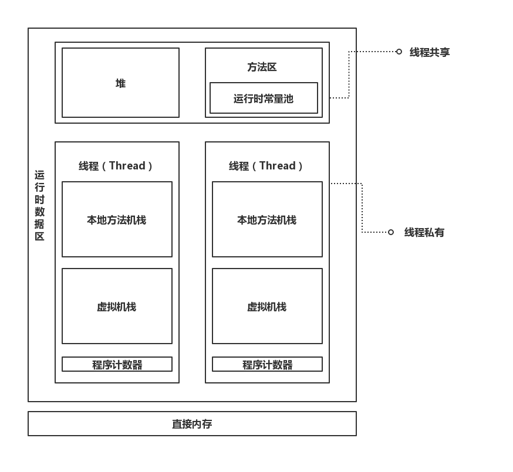

# Java 内存模型

## 1. 概述

JVM 在启动时，会向操作系统申请一块内存空间用来执行 Java 程序，这块由 JVM 管理的内存叫作**运行时数据区**。运行时数据区会被 JVM 分割成不同的区域以作不同的用途：

<left></left>
> 直接内存并不属于运行时数据区，它是JVM之外的一块内存空间。

## 2. 各内存作用区域概述

### 2.1 程序计数器

对于直接运行在 OS 上的程序而言，程序计数器（Program Counter Register，简称 PC 寄存器）是 CPU 中的一个寄存器，保存着一个地址，该地址指向下一条要被执行的命令。

> 在冯·诺依曼结构中，指令与数据都以二进制来存储。比如在内存的某一个单元中存储着`1000110010100000`，可能是一个数据，也可能是一条指令。而 PC 寄存器就是用来区分指令和数据的，当 PC 寄存器指向该内存单元，则其中存储的二进制数表示指令。

对于运行在 JVM 之上的程序而言，JVM 会专门使用一块较小的内存空间来充当PC寄存器，它具有以下一些特性：

- 所有 Java 字节码的执行都要依赖于它。
- PC 寄存器是线程私有的，即每条线程都会被分配一个 PC 寄存器，且互不影响。
- 如果当前正在执行本地方法，则 JVM 中的 PC 寄存器值为空。
- OutOfMemoryError 异常永远不会出现在 PC 寄存器上。

### 2.2 堆

Java 堆在虚拟机启动时就被创建，主要就是用来存放对象实例以及数组。当使用 new 操作的时候，一定会在堆中开辟一块内存空间用于创建对象。

- 主要用于存放对象实例与数组。
- 是线程**共享**的。
- 使用 new 操作的时候，**一定**会在堆中开辟一块新的内存空间用于创建对象。
- 是垃圾收集管理器的主要区域，因此 Java 堆又称为 GC 堆。

### 2.3 虚拟机栈

Java 虚拟机栈用来描述方法执行的内存模型。每一个方法在执行时都会对应有一个栈帧被创建，并被压入虚拟机栈中。当方法执行完后，对应的栈帧又会被弹出，整个过程遵守**先进后出**的规则。

- 是用于描述方法执行的内存模型
- 栈帧的压入与弹出满足先进后出，即 FILO
- 是线程**私有**的

实际上，栈帧才是构成 Java 虚拟机栈的基本单位。

### 2.4 本地方法栈

本地方法栈的作用与 Java 虚拟机栈基本一致，只不过本地方法栈是供本地方法被执行时所使用的。

### 2.5 方法区

- 用于存放已被虚拟机加载的类信息、常量、静态变量（被static关键词修饰的变量）、即时编译器编译后的代码等数据
- 是线程共享的

### 2.6 运行时常量池

运行时常量池是方法区的一部分，常量池包含的内容主要如下：

### 2.7 直接内存

·

## 3. OOM 异常

# JVM 垃圾收集机制

## 1. 判断对象是否是“垃圾”

### 1.1 引用计数法

### 1.2 可达性算法

## 2. Java堆

Java堆是垃圾收集器的重点关注区域，所以Java堆也常被称作**GC堆**。Java堆又被划分为不同的逻辑块：**新生代**与**老年代**。其中新生代又可以分为**Eden**、**From Survivor**、**To Survivor**。

对内存的区域的划分应该是有其意义的，大多是为了方便管理、更好地回收内存以及更好地开辟内存。

## 3. 垃圾收集算法

### 3.1 标记-清除算法

“标记-清除”算法与其名字一样，主要步骤分为：

1. 标记出所有需要回收的对象
2. 回收所有被标记的对象

如果采用标记-清除算法，清除之后的内存难免会变得杂乱无章。随着程序的运行，空闲的内存看似有很多，但不再是连续的。这有点像......GitHub的那张贡献日历图呀：

绿色的小格子代表正在被占用的内存空间，而灰色格子则代表空闲的内存。虽然灰色格子还有很多，**但大多数都不是连续的**。此时，那些空闲但不连续的内存放不下一个对象，便被沦为了**“内存碎片”**，造成了内存的浪费（类似于操作系统中的外部碎片，它属于内存碎片的一种）。

### 3.2 复制算法

为了解决效率问题，可以将内存分为两部分（A和B），其中一块内存A用来**按顺序**进行分配，无需考虑内存碎片等情况，一旦发现内存不够了，就把存活对象拷贝到内存B中，然后将A中的空间全部清理掉。

实际上在Java堆的新生代上，就采用类似于这样的算法，不过新生代不是分成两块而是三块，且**Eden : From_Survivor : To_Survivor = 8 : 1 : 1**。

由于Java中的大多数对象存活时间并不长，也就是所谓的“朝生夕死”，经过一轮垃圾回收后存活的对象数量不多。既然存活数量不多，那么复制操作就不会浪费太多的效率，所以复制算法就比较适合在新生代上使用。而且同样因为存活数量不多，但创建Java创建对象频繁，所以让Eden拥有较大比例的内存。

### 3.3 标记-整理算法

# 类加载

## 类加载的过程

一个类的全部生命周期可以用7个阶段表示：

1. 加载

2. 验证

3. 准备

4. 解析

5. 使用

6. 卸载

其中，验证、准备、解析统称为连接。

下面主要讲一下类加载过程，需要注意一下，这里所谓的类加载过程是由上图中的 **加载、连接、初始化** 这三部分所组成。

## 加载

在加载阶段，JVM的任务主要有以下三个：

- 通过类的全限定名去获取定义此类的二进制字节流
- 将字节流所代表的静态存储结构转化为方法区的运行时数据结构
- 在内存中生成一个代表该类的`java.lang.Class对象`，该对象是访问类在方法区各种数据的入口

需要补充一下的是：

- Class对象并非一定在堆中，对于HotSpot虚拟机就将其存储在方法区中
- 所谓的二进制字节流并没有要求其来源，这意味着它除了可以来自Class文件以外，还可以是网络传输、由其他文件生成、压缩包（JAR、WAR等）、数据库甚至是动态生成

## 连接

### 验证

### 准备

### 解析

## 初始化

## 何时进行初始化？

## 类的被动引用

# 字节码执行引擎

### 栈帧

每一个**正在执行**的方法都会对应有一个栈帧，一个栈帧中存有对应方法中的局部变量表、操作数栈、动态链接、方法出入口等信息。

栈帧也不过就是一块连续的内存而已，只不过里面保存着对应执行方法的相关信息，比如局部变量等等。当方法刚开始执行时，就会向虚拟机栈中压入一个栈帧;当方法结束时（return或者抛出异常），就会弹出该方法所对应的栈帧。

### 局部变量表

局部变量表才更加符合我们平时所说的“Java栈”，它可以存放各种原生类型的数据以及引用类型对象的地址。局部变量表的的大小在编译过程中就已经被确定，所以在执行开始时也就被确定了，且不会在方法执行期间被改变。