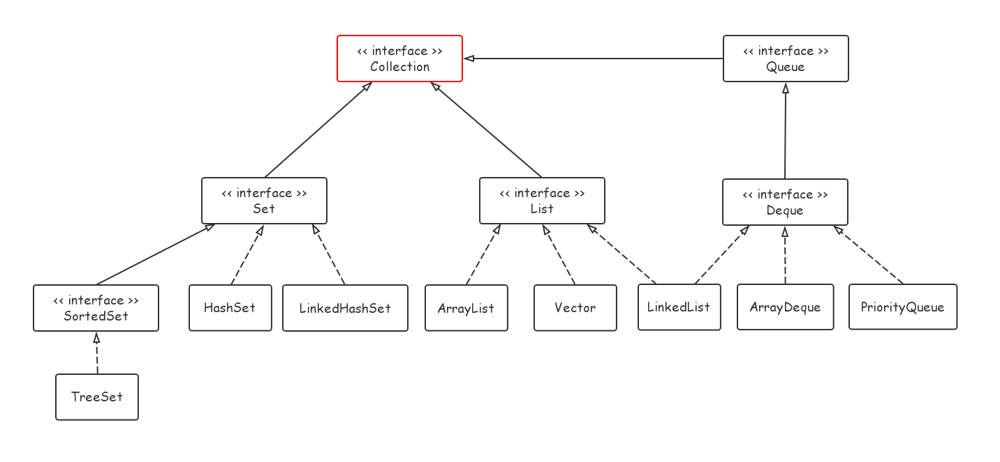
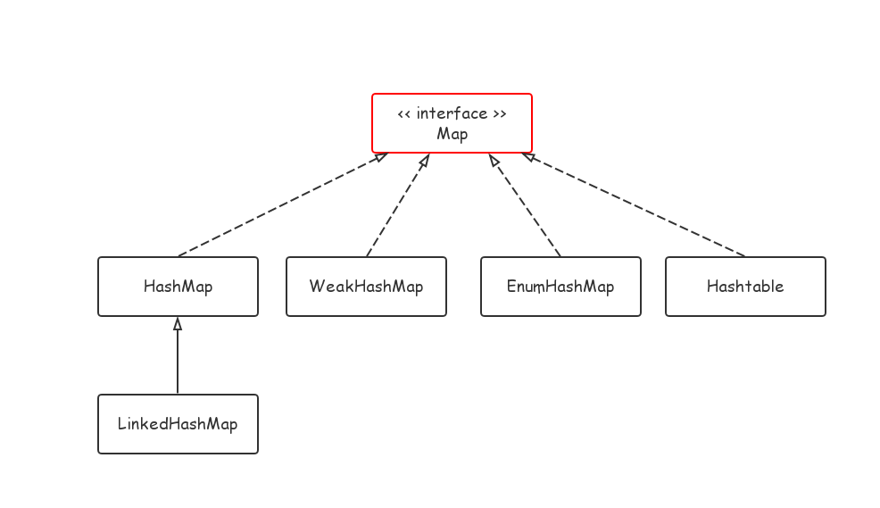

# Java 集合框架概述

集合又叫容器，拥有着与数组一样存放数据的能力，但在不同场景中选择合适的集合可以获得更强大的能力、更高的效率或者是更大的灵活性，Java 中的集合全部都位于 `java.util` 包下。




<left></left>
上面两张图是一些常见集合类之间的继承、实现关系，Java 中的集合类远不止这些。另外，很多集合类都有着线程不安全的问题，因此在 `java.util.concurrent` 包下还实现了很多线程安全的集合专门用于并发编程之中。


# 部分集合类源码分析

## 1. ArrayList

### 1.1 概述

```java
public class ArrayList<E> extends AbstractList<E>
        implements List<E>, RandomAccess, Cloneable, java.io.Serializable
{
    // ... ...
    
    private static final int DEFAULT_CAPACITY = 10; // 初始大小为 10

    transient Object[] elementData;
    
    // ... ...
```

可以看到，ArrayList 的底层是采用数组来实现的，即字段 `elementData`。由于是数组实现的原因，ArrayList 实现了 RandomAccess 接口以表明自己支持快速随机访问。


### 1.2 扩容

既然是数组，就需要在元素装满容器时对数组进行扩充：

```java
private void grow(int minCapacity) {
    // overflow-conscious code
    int oldCapacity = elementData.length;
    int newCapacity = oldCapacity + (oldCapacity >> 1);
    if (newCapacity - minCapacity < 0)
        newCapacity = minCapacity;
    if (newCapacity - MAX_ARRAY_SIZE > 0)
        newCapacity = hugeCapacity(minCapacity);
    // minCapacity is usually close to size, so this is a win:
    elementData = Arrays.copyOf(elementData, newCapacity);
}
```


需要关注于这句代码：`int newCapacity = oldCapacity + (oldCapacity >> 1);`

从这里可以看出 ArrayList 每次扩容的增量都为**原来的一半**。

> `oldCapacity >> 1` 即位操作右移一位。在十进制的世界中，右移一位相当于除以十取整；在二进制的世界中便是除以二取整了。


### 1.3 Fail-Fast


## SynchronizedList 与 Vector

