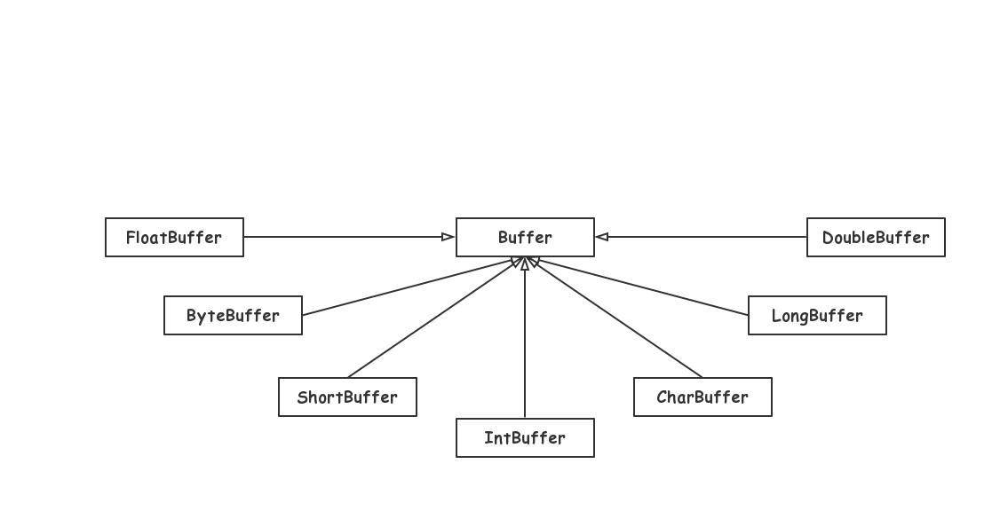
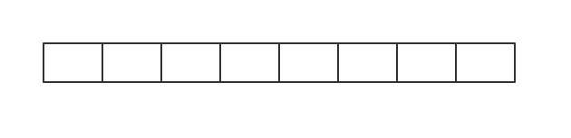
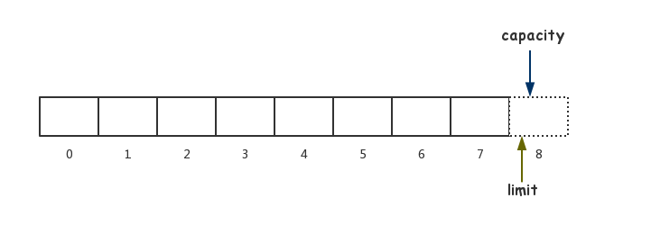
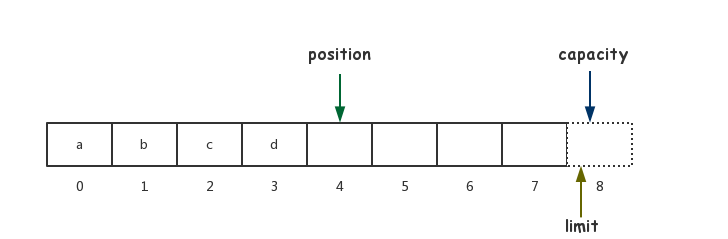
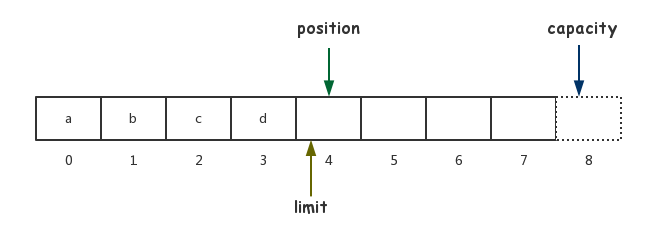
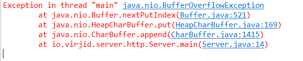

# 五种常见的 IO 模型

## 1. 阻塞 IO


## 2. 非阻塞 IO


## 3. IO 复用


## 4. 信号驱动 IO


## 5. 异步 IO


# NIO 类库简介

## 1. 缓冲区 Buffer

### 1.1 概述

缓冲区实质上就是一个数组，通常我们使用的是字节缓冲区 ByteBuffer，大多数基本类型都有相应的缓冲区：

- ByteBuffer
- CharBuffer
- ShortBuffer
- IntBuffer
- LongBuffer
- FloatBuffer
- DoubleBuffer

其实 ... ... 只有 boolean 没有相应的缓冲区，毕竟它本来就只有 true 和 false 两个值。

<left></left>
这 7 类缓冲区都继承于 Buffer 抽象类，不过这 7 类缓冲区本身也是抽象类，所以无法靠 new 操作符直接实例化。

### 1.2 创建缓冲区

#### 1.2.1 使用 wrap 方法

```java

char[] array = new char[1024];
CharBuffer buffer = CharBuffer.wrap(array);

```

#### 1.2.2 使用 allocate 方法

```java
CharBuffer charBuffer = CharBuffer.allocate(10);
```


### 1.3 缓冲区的状态变量

缓冲区主要有 4 个核心的状态变量：

- capacity                     容量
- limit                            限制
- position                     位置
- mark                          标记

#### 1.3.1 capacity

capacity 即缓冲区 **最多** 可以存放数据的大小。我们可以将另外 3 个状态变量视为 3 个指针，假设我们创建了一个容量为 8 的缓冲区，接下来通过图示来理解这三个变量。


```java
CharBuffer buffer = CharBuffer.allocate(8);
```



#### 1.3.2 limit

limit 可以理解为**「允许读写的字节数」**，而准确地说是**「第一个无法进行读写的索引位置」**。

当刚创建完缓冲区时，limit 应该为 8：

<left></left>
#### 1.3.3 position

position 可以理解为**「当前已经读写的字节数」**，或者是**「下一个要进行读写的索引位置」**。当我们执行如下代码后：

```java
buffer.append('a'); // 向缓冲区放入数据
buffer.append('b');
buffer.append('c');
buffer.append('d');
```

position 为 4，缓冲区图示如下：



#### 1.3.4 改变 limit

通过 `limit()` 可以获取 limit 的值，而通过 `limit(int newLimit)` 则可以重新设置 limit 的值：

```java
buffer.append('a');
buffer.append('b');
buffer.append('c');
buffer.append('d');
buffer.limit(4);
```



此时再执行 `buffer.append('e');` 便会报错：



#### 1.3.5 获取剩余空间

实际上，剩余空间就是 **limit - position** ，不过我们可以直接调用 `remaining()` 方法来获取：

```java
buffer.remaining(); // 0
```


remaining 源代码：

```java
public final int remaining() {
    return limit - position;
}
```

#### 1.3.6 缓冲区压缩

