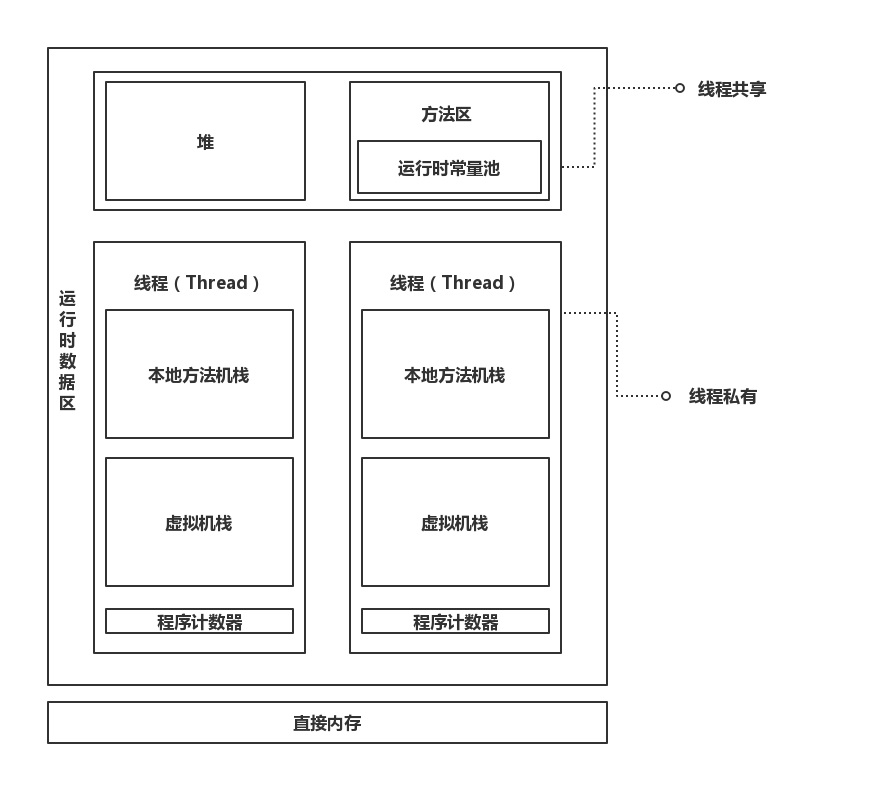
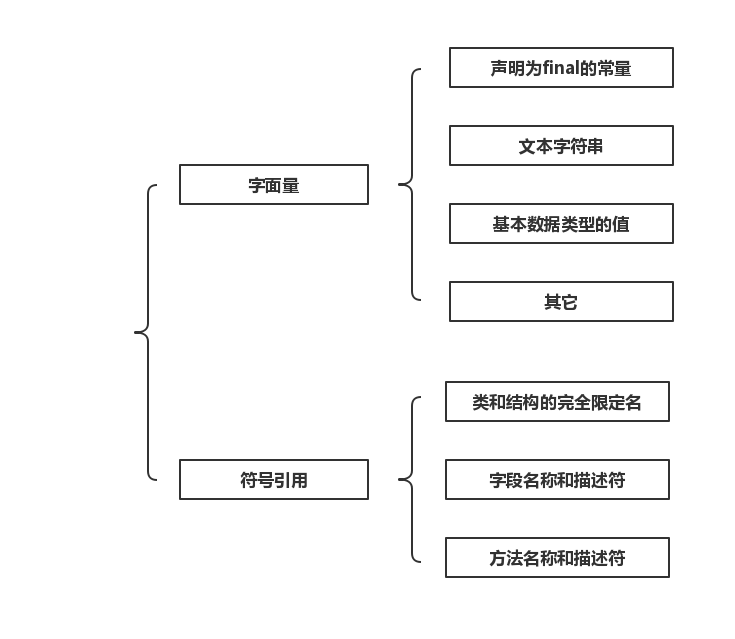

对于不同版本的JDK所包含的JVM可能会有或大或小区别，因此在此处说明本篇博文使用的**版本为1.6**。

## Java内存模型
JVM在启动时，会向操作系统申请一块内存空间用来执行Java程序，这块由JVM管理的内存叫作**运行时数据区**。运行时数据区会被JVM分割成不同的区域以作不同的用途：

> 直接内存并不属于运行时数据区，它是JVM之外的一块内存空间。

## 程序计数器
对于直接运行在OS上的程序而言，程序计数器（Program Counter Register，简称PC寄存器）是CPU中的一个寄存器，保存着一个地址，该地址指向下一条要被执行的命令。

> 在冯·诺依曼结构中，指令与数据都以二进制来存储。比如在内存的某一个单元中存储着`1000110010100000`，可能是一个数据，也可能是一条指令。而PC寄存器就是用来区分指令和数据的，当PC寄存器指向该内存单元，则其中存储的二进制数表示指令。

对于运行在JVM之上的程序而言，JVM会专门使用一块较小的内存空间来充当PC寄存器，它具有以下一些特性：

- 所有Java字节码的执行都要依赖于它。
- PC寄存器是线程私有的，即每条线程都会被分配一个PC寄存器，且互不影响。
- 如果当前正在执行本地方法，则JVM中的PC寄存器值为空。
- OutOfMemoryError异常永远不会出现在PC寄存器上。

## Java虚拟机栈
Java虚拟机栈用来描述方法执行的内存模型。每一个方法在执行时都会对应有一个栈帧被创建，并被压入虚拟机栈中。当方法执行完后，对应的栈帧又会被弹出，整个过程遵守**先进后出**的规则。

- 是用于描述方法执行的内存模型
- 栈帧的压入与弹出满足先进后出，即FILO
- 是线程私有的

实际上，栈帧才是构成Java虚拟机栈的基本单位。

### 栈帧

每一个**正在执行**的方法都会对应有一个栈帧，一个栈帧中存有对应方法中的局部变量表、操作数栈、动态链接、方法出入口等信息。

栈帧也不过就是一块连续的内存而已，只不过里面保存着对应执行方法的相关信息，比如局部变量等等。当方法刚开始执行时，就会向虚拟机栈中压入一个栈帧;当方法结束时（return或者抛出异常），就会弹出该方法所对应的栈帧。

### 局部变量表
局部变量表才更加符合我们平时所说的“Java栈”，它可以存放各种原生类型的数据以及引用类型对象的地址。局部变量表的的大小在编译过程中就已经被确定，所以在执行开始时也就被确定了，且不会在方法执行期间被改变。

## 本地方法栈

本地方法栈的作用与Java虚拟机栈基本一致，只不过本地方法栈是供本地方法被执行时所使用的。

## Java堆

Java堆在虚拟机启动时就被创建，主要就是用来存放对象实例以及数组。当使用new操作的时候，一定会在堆中开辟一块内存空间用于创建对象。

- 主要用于存放对象实例与数组。
- 是线程共享的。
- 使用new操作的时候，一定会在堆中开辟一块新的内存空间用于创建对象。
- 是垃圾收集管理器的主要区域，因此Java堆又称为GC堆。

## 方法区

- 用于存放已被虚拟机加载的类信息、常量、静态变量（被static关键词修饰的变量）、即时编译器编译后的代码等数据
- 是线程共享的

### 运行时常量池

运行时常量池是方法区的一部分，常量池包含的内容如下：

## 直接内存