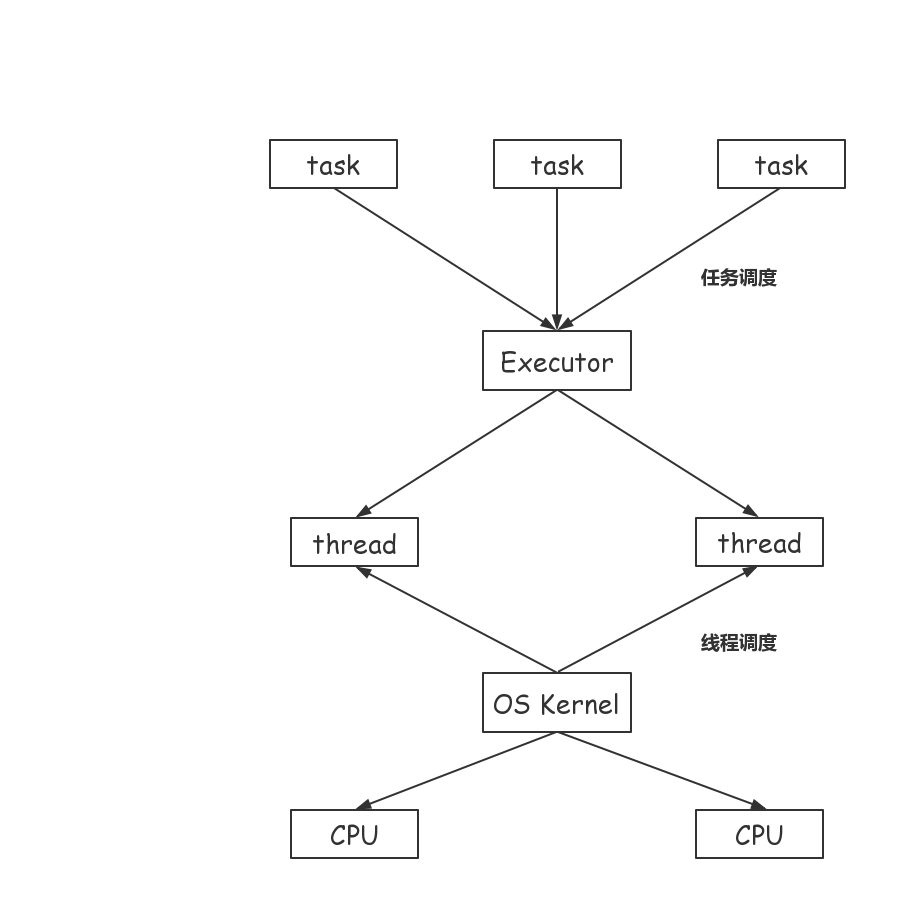
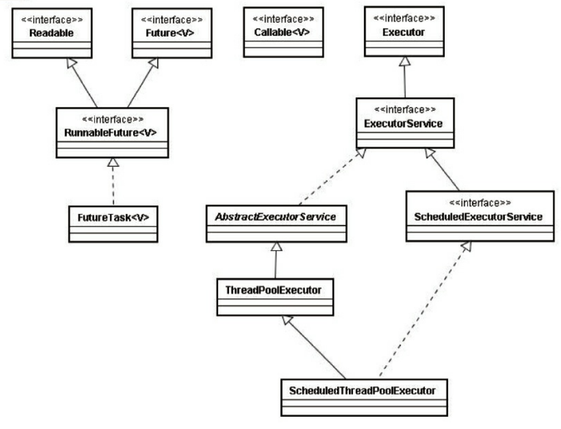
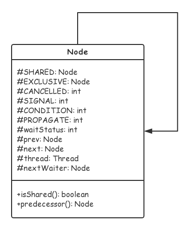
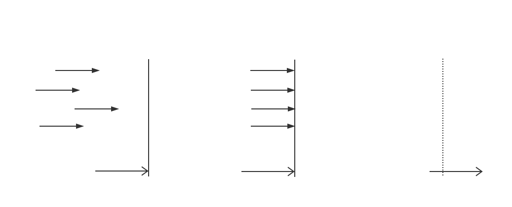
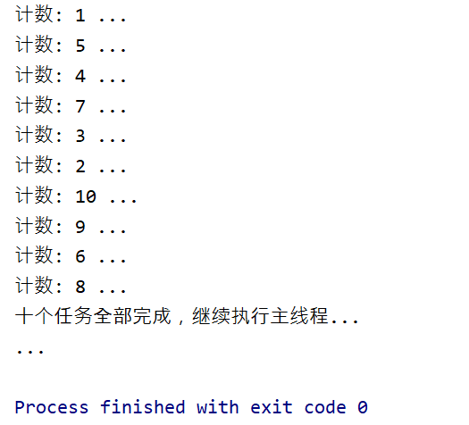
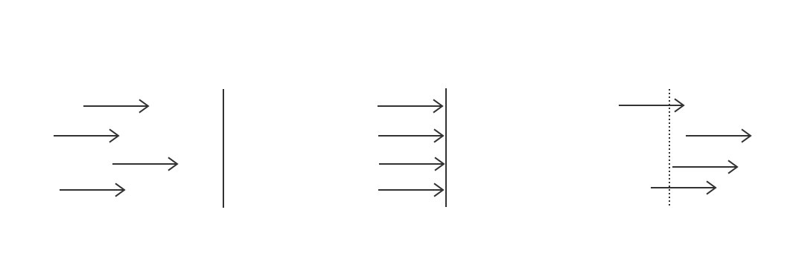
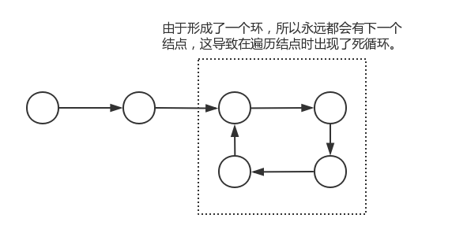
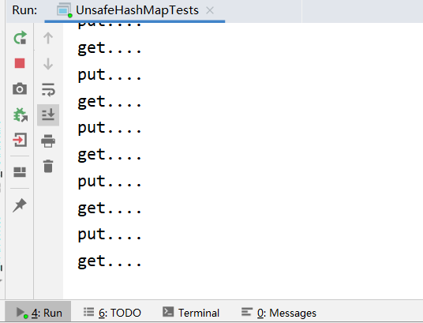
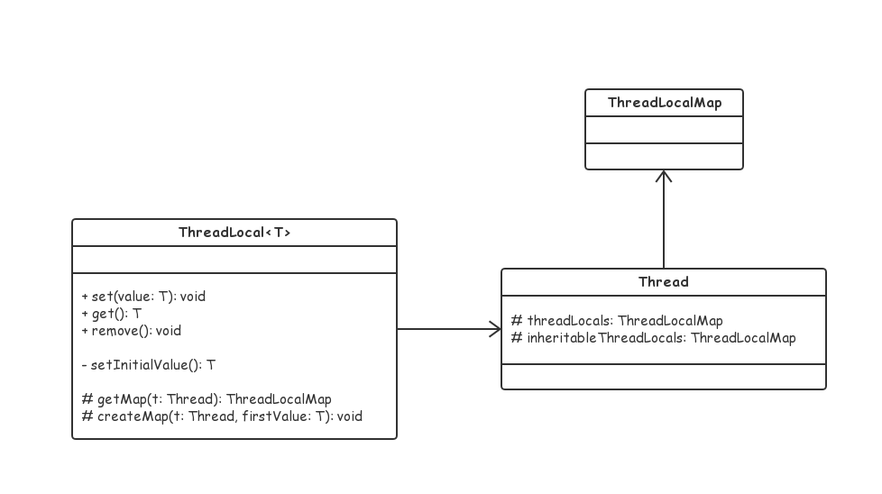
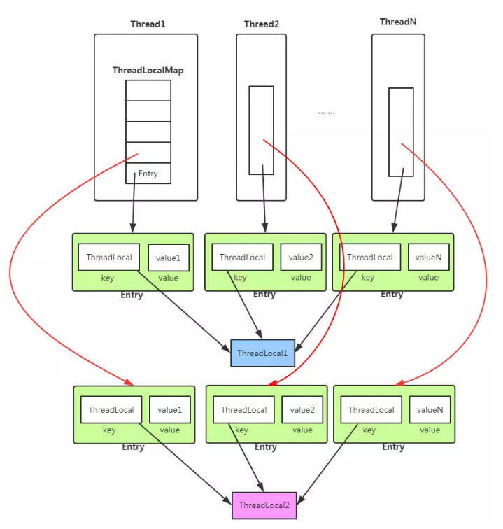

[TOC]

# 并发与并行

## 1. 什么是并发

并发是指一个处理器同时处理多个任务。


## 2. 什么是并行

并行是指多个处理器或者是多核的处理器同时处理多个不同的任务。 


## 3. 并发与并行的区别

并发是逻辑上的同时发生（simultaneous），而并行是物理上的同时发生。也可以说，并发是宏观上的同时发生，而并行是微观上的同时发生。


# 线程

## 1. 进程与线程

进程是最小的资源分配单元，而线程是最小的任务执行单元。


## 2. 线程的状态

- 新建                   NEW
- 可运行               Runnable
- 阻塞                   Blocked
- 等待                   Waiting
- 定时等待           Time Waiting
- 死亡                   Terminated


## 3. Java 线程的基本操作

### 3.1 新建线程

#### 3.1.1 继承于 Thread

```java
Thread thread = new Thread() {
    @Override
    public void run() {
        System.out.println("...");
    }
};

thread.start();
```


#### 3.1.2 实现 Runnable 接口

```java
Thread thread = new Thread(new Runnable() {
    @Override
    public void run() {
        System.out.println("...");
    }
});
		
thread.start();
```


实际上 Thread 自身也实现了 Runnable 接口，所以我们才有了第一种创建线程的方法（继承 Thread ），Thread 类的代码片段：

```java
public class Thread implements Runnable {
    // ... ...
    
    /* What will be run. */
    private Runnable target;
    
    // ... ...
    @Override
    public void run() {
        if (target != null) {
            target.run();
        }
    }
    // ... ...
}
```


#### 3.1.3 实现 Callable 接口

```java
FutureTask<String> task = new FutureTask<>(new Callable<String>() {
    @Override
    public String call() throws Exception {
        System.out.println("...");
        Thread.sleep(2000);
        return "hello";
    }
});

new Thread(task).start();

System.out.println(task.get()); // hello 此处会发生阻塞
```


#### 3.1.4 线程工厂

```java
ThreadFactory factory = Executors.defaultThreadFactory();

Thread thread = factory.newThread(new Runnable() {
    @Override
    public void run() {
        System.out.println("....");
    }
});

thread.start();
```


#### 3.1.5 使用线程池

```java
ExecutorService service = Executors.newCachedThreadPool();

Future<String> future = service.submit(new Callable<String>() {
    @Override
    public String call() throws Exception {
        System.out.println("...");
        Thread.sleep(2000);
        return "hello";
    }
});

System.out.println(future.get());
```


### 3.2 终止线程

JDK 提供了成员方法 `stop()` 方法来终止一个线程：

```java
public static void main(String[] args) throws Exception {
    Thread t1 = new Thread() {
        while (true) {
            System.out.println("...");
        }
    }
    
    t1.start(); // 启动线程
    Thread.sleep(2000); // 阻塞一段时间
    t1.stop(); // 终止 t1 线程
}
```

当一个线程被 stop 后，它会将自己所持有的所有锁进行释放，但由于 stop 太过「暴力」而被标记为不推荐使用。

:x: 假设一条线程抢到锁后对临界资源操作到一半就被终止了。此时锁被释放，而临界资源处于不一致的状态，其它线程抢到锁后自然就会访问到错误的数据。


### 3.3 线程中断

线程中断并不会使得线程立即停止，这是和 stop 最大的不同点，也是相比 stop 的优势。实际上，当中断目标线程时，实际上是向目标线程发送中断通知，至于是否结束自己的 “生命” 依然由目标线程自己来决定。

涉及到中断的方法主要有如下三个：

- `public void Thread.interrupt()`                          中断线程，发送中断通知
- `public boolean Thread.isInterrupted() `            判断是否被中断
- `public boolean Thread.interrupted()`                判断是否被中断并清除中断状态


```java
public static void main(String[] args) throws InterruptedException {
	Thread t = new Thread(()->{
		while(true) {
            // 判断是否被中断，并清除中断状态
			if (Thread.currentThread().isInterrupted()) {
                // 做一些处理以后再退出
				System.out.println("......");
				break;
			} else {
                // 正常工作ing...
				System.out.println("#####");
			}
		}
	});
    
	t.start();
	Thread.sleep(2000);
	t.interrupt();
}
```


### 3.4 wait & notify


### 3.5 suspend & resume

suspend 表示挂起线程，而 resume 时与之相反的执行线程。不过这一对操作已经被标注为废弃，这是因为 ：

- 首先，suspend 在挂起线程的同时并 **不会释放资源** ，这会导致与该资源相关的线程几乎都会受到牵连。
- 其次，通常的需求是在 suspend 操作之后的某一刻再执行 resume，但一旦不小心先执行了 resume，那么被挂起的线程就很有可能无法再有机会继续执行了。


### 3.6 join & yield


### 3.7 sleep & wait

- sleep 和 wait 都可以使线程进入等待状态（准确地说是定时等待）。
- 无论是使用 sleep 还是 wait 进入等待状态，线程都可以被中断（interrupt）。
- sleep 和 wait 之后，线程都会让出 CPU 。当有大量线程同时 sleep 时不会对 CPU 有什么影响，但是大量的线程对象可能会占据太多内存。


- 在 synchronized 同步块中， wait 之后线程会释放锁，但 sleep 之后并不会释放锁。
- wait 后还可以使用 notify 来唤醒线程，但 sleep 之后线程不能被唤醒。


## 4. 线程的优先级


## 5. 守护线程


# 线程池

## 1. 尝试自己实现线程池


## 2. Executor 框架

### 2.1 概述

Java 一开始创建线程的方式使得任务和执行耦合在了一起，而后来 JDK 中出现了 Executor 框架分离了任务与执行。其中任务可以是 Runnable 和 Callable，而执行机制由 Executor 来提供。


Executor 提供的两级调度模型：

<left></left>
Executor 框架主要由 3 部分组成：

- 任务
- 任务的执行
- 异步执行结果


<left></left>
### 2.2 Executor 框架的主要成员

#### 2.2.1 ThreadPoolExecutor

ThreadPoolExecutor 是线程池的核心实现类，用来执行被提交的任务，一般使用工厂类 **`Executors`** 进行创建，当然也可以直接实例化对象。

Executors 可以创建 3 种类型的 ThreadPoolExecutor：

- CachedThreadPool
- FixedThreadPool
- SingleThreadExecutor


**# FixedThreadPool**

FixedThreadPool 可以用于创建拥有固定线程数量的线程池：

```java
ExecutorService es = Executors.newFixedThreadPool(5);
es.execute(new Runnable() {
    @Override
    public void run() {
        System.out.println("...");
    }
});
es.shutdown();

```

FixedThreadPool 适用于为了满足资源管理的需求，而需要限制当前线程数量的应用场景，它适用于负载比较重的服务器。


**# SingleThreadExecutor**

SingleThreadExecutor 相当于线程数量为 1 的 FixedThreadPool：

```java
ExecutorService es = Executors.newSingleThreadExecutor();

```

SingleThreadExecutor 适用于需要保证顺序地执行各个任务；并且在任意时间点，不会有多个线程是活动的应用场景。


**# CachedThreadPool**

```java
ExecutorService es = Executors.newCachedThreadPool();

```

CachedThreadPool是大小无界的线程池，适用于执行很多的短期异步任务的小程序，或者是负载较轻的服务器。


#### 2.2.2 ScheduledThreadPool


#### 2.2.3 Future


#### 2.2.4 Runnable & Callable


# 线程安全

## 1. 死锁

### 1.1 死锁的原因

当多条线程争夺多个资源时，就有可能出现死锁的情况。为方便描述，假设仅有两条线程 A、B 和 两个资源 a、b，A 和 B 必须都同时拥有两个资源才能继续执行下去。若现在 A 占有了 资源 a，B 占有了资源 b，所以 A 无法获得资源 b，而 B 也无法获得资源 a，A、B 一直保持着僵持状态，整个程序永远无法继续执行下去。

### 1.2 自己写一个死锁


### 1.3 解决死锁的办法


# 锁

## 1. 同步与互斥

- 同步：又称 **直接制约关系**，是指多个线程（或进程）为了合作完成任务，必须严格按照规定的 某种先后次序来运行。


- 互斥：又称 **间接制约关系**，是指系统中的某些共享资源，一次只允许一个线程访问。当一个线程正在访问该临界资源时，其它线程必须等待。


## 2. synchronized 关键词

synchronized 是由 JVM 实现的一种能够达到同步或互斥目的的锁机制。synchronized 可以作用在方法或代码块，并需要指定所使用的锁（在 Java 中 **任何** 对象皆可以充当锁）：

```java

public class TestLock {
	private static class Task implements Runnable {
		@Override
		public void run() {
			Object lock = new Object();
			
            /*
             * 将一个 Object 对象 lock 作为一把锁。任何线程要访问被 synchronized 关键词
             * 标识的代码块，必须去尝试争抢 lock 这把锁。只有拥有锁的线程才可以进入代码块，
             * 否则只能进入阻塞态等待下一次抢锁机会的到来。
             */
			synchronized(lock) {
				System.out.println(Thread.currentThread());
			}
			
		}
	}
	
	
	public static void main(String[] args) {
		Thread t1 = new Thread(new Task());
		Thread t2 = new Thread(new Task());
		
        /*
         * t1 和 t2 会经历抢锁的过程，但我们依然无法断定到底是哪一个线程 
         * 会先执行打印语句，因为抢锁结果是随机的，我们无法判断谁会先抢得
         * 锁。不过我们可以断定的是，当一个线程执行打印语句时，另一个线程
         * 绝无执行打印语句的可能。
         */
		t1.start();
		t2.start();
	}
}

```


上面是一个 synchronized 修饰代码块的例子，接下来看一下修饰成员方法和静态方法的例子：

```java

public class TestLock {
	public synchronized void test() {
		System.out.println(Thread.currentThread());
	}
	
	public synchronized static void test2() {
		System.out.println(Thread.currentThread());
	}
}

```


实际上方法也是代码块，所以理解方式并没有发生改变，只是我们没有再自己指定锁对象了。准确地说，是隐式指定了锁对象，上面的代码等价于：

```java

public class TestLock {
    // 成员方法实际上使用的是 this 对象作为锁
	public void test() {
		synchronized (this) {
			System.out.println(Thread.currentThread());
		}
	}
    
    // 静态方法则是使用相应的元类对象作为锁
	public static void test2() {
		synchronized (TestLock.class) {
			System.out.println(Thread.currentThread());
		}
	}
}

```


## 3. Lock 接口

synchronized 将**「获取锁 — 执行 — 释放锁」**这一过程隐藏了起来，使用起来虽然方便但却不灵活。在 `java.util.concurrent.locks` 包下有定义了一个名为 `Lock` 的接口，它用于实现像 synchronized 关键词一样的功能，但需要显示地去获取、释放锁。这听起来好像变麻烦了，但也带给了我们更大的灵活性。


```java

Lock lock = new ReentrantLock(); // 获得锁对象

lock.lock(); // 加锁
try {
    System.out.println("...");
} finally {
    lock.unlock(); // 释放锁
}

```


`ReentrantLock` 是 Lock 接口的一个实现类，上面的代码可以看作：

```java

synchronized(Object.class) { // 可以选用任意的对象作为锁
    System.out.println("...");
}

```


## 4. 可重入锁 ReentrantLock

就在刚才我们已经见过了可重入锁，现在解释一下什么叫作 **「可重入锁」** ：

> 重入锁，顾名思义，就是支持重进入的锁，它表示该锁能够支持一个线程对资源的重复加锁。


想象一个场景，我们在循环代码块 **内部** 进行加锁。

- 第一次循环时，线程抢到锁后便能够顺利执行下去。
- 第二次循环时，又要求加锁。此时如果是 **不可重入锁** ，就不能重复加锁，即使手上有锁也无法执行了。


现在我们写一个简易的不可重入锁来模拟上述情景：

```java
// 一个不可重入锁
public class MyLock {
	private boolean isLocked = false;

	public synchronized void lock() throws InterruptedException {
		while (isLocked) {
			wait();
		}
		isLocked = true;
	}

	public synchronized void unlock() {
		isLocked = false;
		notify();
	}
}


// 模拟情景
public class TestLock {
	public static void lockInvoke() throws Exception {
		MyLock lock = new MyLock();
		int i = 0;
		while(i++ < 10) {
			lock.lock();
			System.out.println("....");
		}
		lock.unlock();
	}
	
	public static void main(String[] args) throws Exception {
		lockInvoke();
	}
}


// 输出情况：只会打印一次 ... ，且程序不断运行无法自己终止。
```


现在再替换成可重入锁查看效果：

```java
public class TestLock {
	public static void lockInvoke() throws Exception {
		Lock lock = new ReentrantLock(); // 只需要替换此处为可重入锁即可
		int i = 0;
		while(i++ < 10) {
			lock.lock();
			System.out.println("....");
		}
		lock.unlock();
	}
	
	public static void main(String[] args) throws Exception {
		lockInvoke();
	}
}


// 输出情况：会打印十次 ... ，且程序自己终止。
```


## 5. ReentrantLock 与 synchronized


实际上使用 synchronized 同样是 **可重入的** ，下面举出一些两者之间的区别：

<!-- 使用 synchronized 是无法重现上面的情景的，这也是为什么说 synchronized 不灵活 -->

**1. 锁的实现**

synchronized 是 JVM 实现的，而 ReentrantLock 是 JDK 实现的。

**2. 性能**

新版本 Java 对 synchronized 进行了很多优化，例如自旋锁等，synchronized 与 ReentrantLock 大致相同。

**3. 等待可中断**

当持有锁的线程长期不释放锁的时候，正在等待的线程可以选择放弃等待，改为处理其他事情。

ReentrantLock 可中断，而 synchronized 不行。

**4. 公平锁**

公平锁是指多个线程在等待同一个锁时，必须按照申请锁的时间顺序来依次获得锁。

synchronized 中的锁是非公平的，ReentrantLock 默认情况下也是非公平的，但是也可以是公平的。

**5. 锁绑定多个条件**

一个 ReentrantLock 可以同时绑定多个 Condition 对象。


## 6. 排他锁

无论是 ReentrantLock 还是 synchronized ，它们都属于排他锁。所谓**「排他锁」**，即在同一时刻只能有一条线程持有该锁。


## 7. 读写锁

在有些情况下，排他锁的设计并不是那么合理。比如，很多时候我们希望同一时刻只能有一条线程进行写操作，但允许多条线程进行读操作。具体地说，我们需要的读写锁至少需要如下特点：

- 当有线程进行写操作时，不能有其它任何线程进行读写操作
- 当有线程进行读操作时，可以有其他线程同时进行读操作，但不能有任何的线程进行写操作


Java 提供了一个读写锁的接口 ReadWriteLock ，它的一个实现 ReentrantReadWriteLock 具有如下额外的特点：

- 公平性选择
- 可重进入
- 锁降级


## 8. LockSupport

```java
public class LockSupportTests {
    public static void main(String[] args) {
        Thread thread = new Thread(()->{
            try {
                Thread.sleep(5000);
                LockSupport.park();
                System.out.println("park end...");
            } catch (Exception e) {e.printStackTrace();}
        });
        thread.start();

        LockSupport.unpark(thread);
    }
}
```


## 9. AQS

### 9.1 原理概述

AQS 全称为 AbstractQueuedSynchronizer ，其本质其实是一个 **双向队列**，队列的元素是内部类 Node 的实例对象，而每一个 Node 结点都含有一个线程对象：


AQS 的核心理念是：

- 如果被请求的共享资源空闲，则将当前请求资源的线程设置为有效的工作线程，并将共享资源设置为锁定状态。
- 如果被请求的共享资源被占用，那么就需要一套线程阻塞等待以及唤醒时锁分配的机制，这个机制 AQS 是用 CLH 队列锁实现的，即将展示获取不到锁的线程加入到队列中。 


AQS 使用一个 int 成员变量来表示同步状态，通过内置的 FIFO 队列来完成获取资源线程的排队工作。AQS 使用 CAS 对该同步状态进行原子操作实现对其值的修改。

```java
private volatile int state;// 共享变量，使用volatile修饰保证线程可见性
```


状态信息通过 protected 类型的 getState ，setState ，compareAndSetState 进行操作

```java
//返回同步状态的当前值
protected final int getState() {  
    return state;
}

// 设置同步状态的值
protected final void setState(int newState) { 
    state = newState;
}

//原子地（CAS操作）将同步状态值设置为给定值update如果当前同步状态的值等于expect（期望值）
protected final boolean compareAndSetState(int expect, int update) {
    return unsafe.compareAndSwapInt(this, stateOffset, expect, update);
}
```


### 9.2 Node 结点

前面说了 AQS 本质是一个双向队列，而这个队列中元素都为 Node 实例对象，其中 Node 类的类图如下：

<left></left>
- thread 变量用于存放 AQS 队列中的线程
- SHARED 用来标记线程是获取共享资源时被阻塞挂起的
- EXCLIUSIVE 用来标记线程是获取独占资源时被挂起的
- waitStatus 用来记录当前线程等待状态
- prev 记录前驱结点，next 记录后继节点
- state 表示状态信息，常被被视为资源（或者说是资源数量）


### 9.3 条件变量


### 9.4 模板模式


### 9.5 AQS 中的模板模式

AQS 可重写的方法：

<table>
    <thead>
        <tr>
            <th width="150">方法名</th>
            <th width="150">参数</th>
            <th width="100">返回类型</th>
            <th>说明</th>
        </tr>
    </thead>
    <tbody>
        <tr>
            <td>tryAcquire</td>
            <td>int arg</td>
            <td>boolean</td>
            <td>独占式获取同步状态，实现该方法需要查询当前状态并判断同步状态是否符合预期，然后再进行 CAS 设置同步状态</td>
        </tr>
        <tr>
            <td>tryRelease</td>
            <td>int arg</td>
            <td>boolean</td>
            <td>独占式释放同步状态，等待获取同步状态的线程将有机会获取同步状态</td>
        </tr>
    </tbody>
</table>


AQS 提供的模板方法：

<table>
    <thead>
        <tr>
            <th width="80">方法名</th>
            <th width="200">参数</th>
            <th width="100">返回类型</th>
            <th>说明</th>
        </tr>
    </thead>
    <tbody>
        <tr>
            <td>acquire</td>
            <td>int arg</td>
            <td>void</td>
            <td>独占式获取同步状态，如果当前线程获取同步状态成功，则由该方法返回，否则，将进入同步队列等待。该方法将会调用重写的 tryAcquire(int arg) 方法。</td>
        </tr>
        <tr>
            <td>acquireInterruptibly</td>
            <td>int arg</td>
            <td>void</td>
            <td>与 acquire(int arg) 方法类似，但能够响应中断。</td>
        </tr>
        <tr>
            <td>tryAcquireNanos</td>
            <td>int arg, long nanos</td>
            <td>boolean</td>
            <td>在 acquireInterruptibly(int arg) 方法的基础上添加了超时限制，如果在指定时间内没有获取到同步状态，则返回 false</td>
        </tr>
    </tbody>
</table>


### 9.6 自定义同步工具

```java
public class Mutex implements Lock {
    private static class Sync extends AbstractQueuedSynchronizer {
        // 是否处于占用状态
        protected boolean isHeldExclusively() {
            return getState() == 1;
        }

        public boolean tryAcquire(int acquires) {
            if (compareAndSetState(0, 1)) {
                setExclusiveOwnerThread(Thread.currentThread());
                return true;
            }
            return false;
        }

        protected boolean tryRelease(int releases) {
            if (getState() == 0) {
                throw new IllegalMonitorStateException();
            }
            setExclusiveOwnerThread(null);
            setState(0);
            return true;
        }

        Condition newCondition() {
            return new ConditionObject();
        }
    }

    private final Sync sync = new Sync();

    @Override
    public void lock() {
        sync.acquire(1);
    }

    @Override
    public void lockInterruptibly() throws InterruptedException {
        sync.acquireInterruptibly(1);
    }

    @Override
    public boolean tryLock() {
        return sync.tryAcquire(1);
    }

    @Override
    public boolean tryLock(long time, TimeUnit unit) throws InterruptedException {
        return sync.tryAcquireNanos(1, unit.toNanos(time));
    }

    @Override
    public void unlock() {
        sync.release(1);
    }

    @Override
    public Condition newCondition() {
        return sync.newCondition();
    }
}
```


## 10. CountDownLatch

`CountDownLatch` 可以翻译成**「倒计数门闩」**，当然称之为 **「倒计数器」** 可能会更好理解。简而言之，该同步工具的作用是阻止一个线程继续执行（就像门闩一样），然后进行倒计数，计数结束后再将该线程放行。



```java
public class CountDownLatchTests {
    public static void main(String[] args) throws InterruptedException {
        CountDownLatch latch = new CountDownLatch(10);
        ExecutorService service = Executors.newFixedThreadPool(5);
        for (int i = 0; i < 10; i++){
            final int num = i+1;
            service.submit(new Runnable() {
                @Override
                public void run() {
                    System.out.println("计数: "+num+" ...");
                    latch.countDown();
                }
            });
        }
        
        // 等待10次计数结束后继续执行
        latch.await();
        System.out.println("十个任务全部完成，继续执行主线程...");
        
        // 计数器计数完成后无法重新开始计数，所以会继续执行下去
        latch.await();
        System.out.println("...");

        service.shutdown();
    }
}
```

<left></left>
## 11. CyclicBarrier

`CyclicBarrier` 称为**「循环栅栏」**，它和 `CountDownLatch` 非常相似。简而言之，它就像栅栏一样阻止一群线程继续执行，当这群线程全部到达 “栅栏” 处后再将所有线程放行，而 “循环” 的意思是指该栅栏可以重复使用。



```java
、ipublic class CyclicBarrierTests {
    public static void main(String[] args) {
        CyclicBarrier barrier = new CyclicBarrier(3);
        ExecutorService es = Executors.newFixedThreadPool(10);
        
        // 启动3个任务
        for (int i = 0; i < 3; i++) {
            es.submit(new Runnable() {
                @Override
                public void run() {
                    try {
                        
                        // 每个任务分为3个阶段，要求所有任务必须全部完成当前阶段，
                        // 才可一起进入下一个阶段
                        for(int j = 0; j < 3; j++) {
                            System.out.println("该任务第 "+(j+1)+" 阶段执行完毕");
                            barrier.await();
                        }
                        
                    } catch (Exception e) {e.printStackTrace();}
                }
            });
        }

        es.shutdown();
    }
}
```

> 注意，这里线程池的大小要大于等于3，否则永远不可能有三个任务一起完成某一个阶段，因为线程的数量不够同时执行3个任务。


# 锁优化

## 1. 自旋锁

由于线程进入阻塞态的开销是比较大的，而在大多时候共享数据的锁定状态又仅仅持续一小段时间，于是 JVM 使用自旋锁对这样的问题进行优化。

自旋锁的思想是，让本应该进入阻塞态的线程忙循环（自旋）一段时间，如果在这一小段时间内能够获取到锁🔒，就能够避免进入阻塞态。但如果自旋一定次数后依然没有抢到锁，则停止自旋进入阻塞态。


## 2. 锁消除

锁消除是指 JVM 对不可能存在竞争的共享数据的锁进行消除。


## 3. 锁粗化 ❀

虽然我们往往都会说锁的粒度要小，但也并非总是如此。如果出现一块代码块**连续反复地**出现加锁与解锁操作会导致性能的损耗，我们完全没有必要让锁的粒度小到这般地步。


# JDK 并发容器

## 1. 概述

JDK 提供的并发容器主要存在于 `java.util.concurrent` 包中，为我们提供了与许多能够保证线程安全的容器类，下面先列举一二：

**#1. ** `ConcurrentHashMap`

可以理解为是一个既保证了线程安全又高效的 HashMap，性能高于同为线程安全的 Hashtable 。

**#2.** `CopyOnWriteArrayList`

是一个 List，和 ArrayList 一样底层使用数组实现，在读多写少的情况下性能很好，且性能高于 Vector 。

**#3.** `ConcurrentLinkedQueue`

使用链表实现的高效并发队列，可看作是线程安全的 LinkedList 。

**#4. ** `BlockingQueue`

一个接口，表示阻塞队列。该接口有各种方式的实现，如链表、数组 。

**#5.** `ConcurrentSkipListMap`

跳表的实现，从名字上可以看到是一个 Map，可以进行快速查找。


## 2. 不安全的 HashMap

### 2.1 HashMap 的并发问题

在并发情况下，Java 的哈希表（HashMap）在扩容时有可能出现单向链表循环引用的情况，也就是说在单向链表中出现了环。可以想象到，当遍历含有环的单向链表时，就会出现死循环：

<left></left>
尝试模拟引发 HashMap 的线程安全问题：

```java
public class UnsafeHashMapTests {
    public static void main(String[] args) {
        HashMap<String, String> map = new HashMap<>(2);

        Runnable task = () -> {
            for (int i = 0; i < 1000000; i++) {
                String uuid = UUID.randomUUID().toString();
                map.put(uuid,"");
                System.out.println("put....");
                map.get(uuid);
                System.out.println("get....");

            }
        };


        new Thread(task).start();
        new Thread(task).start();
    }
}
```


当我运行到如下情景时程序已经卡死不动了：

<left></left>
### 2.2 使用 Hashtable

如果点击查看 Hashtable 的源代码可以发现它几乎所有的方法都添加了 `synchronized` 关键词，所以 Hashtable 是线程安全的而不会出现和 HashMap 一样的问题，但是既然使用了锁其性能也势必会下降。


### 2.3 ConcurrentHashMap

ConcurrentHashMap 同样是线程安全的，但性能要远好于 Hashtable。之所以能既保证线程安全又高效的原因是，Hashtable 直接使用 synchronized 关键词将整个 Map 数据锁住了，而 ConcurrentHashMap 使用的是**「分段锁」**，只锁住必要的部分而降低了锁的粒度。

在默认情况下，HashMap 有 16 个桶，ConcurrentHashMap 亦是如此，所以 ConcurrentHashMap 默认分配 16 把锁，每一把锁对应一个桶。例如，当一个线程对某一个桶进行插入操作时，仅对该桶进行加锁。对于 Hashtable 来说，同时只能有一个线程执行插入操作；对于 ConcurrentHashMap 来说，同时最多可以有 16 个线程进行插入操作，效率极大提升。


## 3. 获取线程安全的容器

Collections 提供了多个静态方法来将 Java 容器封装为一个线程安全的容器：

```java
// 将 List 变为线程安全的
List<String> list = new LinkedList<>();
List<String> safeList = Collections.synchronizedList(list);

// 将 Map 变为线程安全的
HashMap<String,String> map = new HashMap<>(16,1);
Map<String,String> safeMap = Collections.synchronizedMap(map);

// 将 Collection 变为线程安全的
Collection<String> col = new ArrayList<>();
Collection<String> safeCol = Collections.synchronizedCollection(col);

// ... ...
```


打开源码就可以发现，实际上 Collections 只是对接口方法全部加上了 synchronized 关键词。


# 并发中的模式与算法

## 1. CAS


## 2. 线程安全的单例模式

```java
public class Singleton {
	private Singleton() {}
	
	private static class Inner {
		static Singleton instance = new Singleton();
	}
	
	public static Singleton getInstance() {
		return Inner.instance;
	}
}

```


## 3. ThreadLocal

### 3.1 概述与使用示例

ThreadLocal 是由 JDK 提供的一个工具类，它也是解决并发问题的一种思路。ThreadLocal 维护变量时，它会为每一条要使用到该变量的线程创建一个变量的副本，线程只会访问、操作属于自己的变量副本。


```java
public class TestThreadLocal {
	static ThreadLocal<String> localVariable = new ThreadLocal<>();
    
	static void paint() {
		StringBuffer buffer = new StringBuffer();
		buffer.append(Thread.currentThread().getName());
		buffer.append(":  ");
        
        // get 方法
        // 获取当前运行线程的变量副本（或者称为本地变量）
		buffer.append(localVariable.get());
        
		System.out.println(buffer.toString());
	}
	
	public static void main(String[] args) {
		Thread one = new Thread(()->{
            
            // set 方法
            // 创建当前运行线程的变量副本
			localVariable.set("thread-one");
            
			paint();
            
            // remove 方法
            // 移除当前运行线程的变量副本
			localVariable.remove();
		}, "ThreadOne");
		
		Thread two = new Thread(()->{
			localVariable.set("thread-two");
			paint();
			localVariable.remove();
		}, "ThreadTwo");
		
		one.start();
		two.start();
	}
}

```


不同线程就像是平行世界一样，每个世界线都可能完全不一样。线程共享的对象就像是**「穿梭者」**，处于上帝视角，脱离了世界线的约束。而 ThreadLocal 则像是一个生存于多个世界线的角色，不同世界线的 ThreadLocal 是同一个人，但又完全不一样且互不干扰。


### 3.2 ThreadLocal 实现原理

<left></left>
<left></left>
### 3.3 InheritableThreadLocal


## 4. 生产者与消费者

### 4.1 概述

**「生产者—消费者」**模式为多线程协作提供了一个良好且易理解的解决方案。其基本的思想还是很简单的，整个模式的重要角色有以下几类：

- 生产者：专门产生数据的线程（组）
- 消费者：消费数据的线程（组），所消费的数据来自于生产者
- 数据：就像商品一样被生产者所生产
- 缓冲池：就像货架一样被用来存放生产出来的数据


其大概的流程如下：

1. 生产者生产了数据，并尝试将数据存放于缓冲池
2. 如果缓冲池已满，则该生产者开始等待缓冲池出现可用空间用来存放数据
3. 消费者尝试从缓冲池中拿取数据
4. 如果缓冲池中不存在数据，则消费者开始等待数据的出现


这样的模式有着很重要优势：

- 通过缓冲池将生产者与消费者 **解耦** 。我们可以发现生产者只负责生产、存放数据，而消费者只负责拿取、消费数据，**它们互相都无需知道对方的存在** 。
- 通过缓冲池可以缓解生产任务与消费任务的效率差异。即使在硬件上，许多效率不对等的问题也经常使用缓冲来解决（比如存储器的等级结构）。


### 4.2 使用 BlockingQueue 的实现

```java
/**
  * 数据
  */
public class PCData { }


/**
  * 生产者
  */
public class Producer implements Runnable {
    private BlockingQueue<PCData> bq;

    public Producer(BlockingQueue<PCData> bq) { this.bq = bq; }
    
    @Override
    public void run() {
        while(true) {
            try {
                Thread.sleep(1000);
                PCData data = new PCData();
                bq.put(data);
                System.out.println("放入一个数据");
            } catch (InterruptedException e) { e.printStackTrace();}
        }
    }
}

/**
  * 消费者
  */
public class Customer implements Runnable {
    private BlockingQueue<PCData> bq;
    public Customer(BlockingQueue<PCData> bq) { this.bq = bq; }

    @Override
    public void run() {
        while(true) {
            try {
                bq.take();
                System.out.println("拿走一个数据");
            } catch (InterruptedException e) { e.printStackTrace(); }
        }
    }
}


/**
  * 测试用例
  */
public class PCTests {
    /**
      * 阻塞队列，用作缓冲池
      */
    static LinkedBlockingQueue<PCData> lbq = new LinkedBlockingQueue<>(2);


    public static void main(String[] args) {
        Producer producer1 = new Producer(lbq);
        Producer producer2 = new Producer(lbq);
        Producer producer3 = new Producer(lbq);

        Customer customer1 = new Customer(lbq);
        Customer customer2 = new Customer(lbq);

        ExecutorService service = Executors.newFixedThreadPool(5);

        service.submit(producer1);
        service.submit(producer2);
        service.submit(producer3);
        service.submit(customer1);
        service.submit(customer2);
    }
}
```