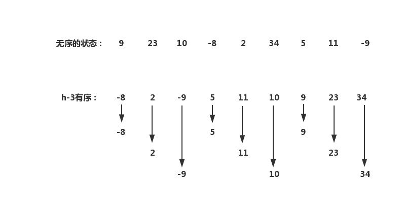

## 插入排序

说明插入排序的过程，最常用的例子就是扑克


可以想象到，牌堆里的牌是无序的，而手中的牌是有序的。但是在所有牌都排完序之前，手中每张牌的具体位置依然没有被确定下来（比如在上图中的梅花4位于第二个位置，但如果插入一张梅花3，那梅花4以及它之后的牌都要向后移动一个位置）。


在数组排序中，可以将一个数组分成两个部分：手牌与牌堆。

1. 在排序一开始，手牌只有一张，即索引为0的元素，而右边部分全是牌堆中的牌。
2. 从数组的右边部分（牌堆）中，取出第一个元素。
3. 将取出的元素与数组左边部分（手牌）的元素依次比较，并插入到合适的位置（此时手牌数量加1，而牌堆元素的数量减1）。
4. 重复2、3步骤，直到牌堆中元素的数量为0。


下面就是Java的实现了：

```java
public class InsertSort {
    public static <T extends Comparable<T>> void sort(T[] a) {
        for (int i=0; i<a.length-1; i++) {
            
            // i表示手牌中最大的那张牌的索引
            // i+1可以认为是牌堆中的第一个元素的索引
            for (int j=i+1; j>0; j--) {
                if (SortUtil.less(a[j], a[j-1]))
                    SortUtil.swap(a, j, j-1);
                
                else break; // 已经将牌插入到合适的位置，跳出循环
            }
        }
    }
    
    
    public static void main(String[] args) {
        Integer[] a = new Integer[] {1,2,34,1,435,76,-4};
        sort(a);
        SortUtil.show(a);
    }
}
```


## 希尔排序

假设我们的目的并不是让整个数组有序，而是要求任意数组中任意**间隔为h**的元素都是有序的：



> 我在这里使用**h-x**的形式，来表示h=x的有序状态。很明显，当整个数组有序时，**等价于h-1有序**。


h将一个数组分割成了**多组**，对每组进行插入排序，然后缩小h再对每组进行插入排序......如此反复，直到h=1时，数组中的所有元素都被归为了**一组**，此时再进行一次插入排序即可完成整个数组的排序操作。


上面就是对希尔排序粗略的描述，而大致的代码框架如下：

```java
public static <T extends Comparable<T>> void sort(T[] a) {
    int h = 9; //给h一个任意的初始值
    
    while (h>=1) {
        
        // ...在这里对每组进行排序...
        
        h/=3; //不断地递减h
    }
}
```


关于如何对每组进行排序，当然可以选择想办法将每组先分开再分别进行排序，但更好的方式是直接在数组内跨组进行插入排序：

```java
public class ShellSort {
	public static <T extends Comparable<T>> void sort(T[] a) {
        int h = 9; //给h一个任意的初始值
        
        while (h>=1) {
            for (int i = 0; i<a.length-h; i++)
                for (int j = i+h; j>h-1; j-=h)
                    if (SortUtil.less(a[j], a[j-h]))
                        SortUtil.swap(a, j-h, j);
					else break;
            
            h/=3; //不断地递减h
        }
    }
    
    public static void main(String[] args) {
        Integer[] a = new Integer[] {1,2,34,1,435,76,-4};
        sort(a);
        SortUtil.show(a);
    }
}
```

实际上，将h赋为1时，其代码和插入排序完全一样。**每一次的shell排序，其实就是，间隔为h的插入排序**。


而对于h如何选取初始值，以及如何递减h......我暂时也不知道是否有最佳的h初始值以及最佳的递减方案。