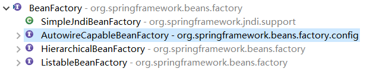

[TOC]

# IoC 与 DI 的思想

## 1. 交出控制权

这里有一位牙医，他拥有一个诊治病人的方法 `treatment` 。

```java
public class Dentist {
	public void treatment(Patient patient) {
		System.out.println("treatmenting by a dentist...:"+patient.getName());
	}
}
```
现在有一位病人向医生寻求帮助：


```java
public class Patient {
	private Dentist doctor = new Dentist();
    private String name;
	private String disease;
	
	public void askForHelp() {
		doctor.treatment(this);
	}
    
    // ... 省略 setter&getter 方法 ...
}
```

很明显，病人去看哪位医生完全是由他自己决定的，这会导致一些问题：

- 病人得的未必是牙疼，你去找牙医 ... ... 似乎有些强人所难
- 病人可能不太懂应该找什么医生比较合适


我们需要引入这么一个角色，他管理着各种各样的医生，并且能够决定为病人分配哪一位医生，也就是 Hospital 类，并且为了统一管理医生还需要引入一个 Doctor 接口。下面是所有的代码：

```java
public interface Doctor {
    void treatment(Patient patient);
}
```

```java
public class Dentist implements Doctor {
    public void treatment(Patient patient) {
		System.out.println("treatmenting by a dentist...:"+patient.getName());
	}
}
```

```java
public class EmergencyDoctor implements Doctor {
	public void treatment(Patient patient) {
		System.out.println("treatmenting by an emergency doctor... :"+patient.getName());
	}
}
```

```java
public class Patient {
	private Doctor doctor;
    private String name;
	private String disease;
	
	public void askForHelp() {
		doctor.treatment(this);
	}
    
    // ... 省略 setter&getter 方法 ...
}
```

```java
public class Hospital {
    public void allocateDoctor(Patient patient) {
        patient.setDoctor(new EmergencyDoctor());
    }
}
```

```java
public class Client {
    public static void main(String[] args) {
        Hospital hospital = new Hospital();
        Patient patient = new Patient();
        patient.setName("Virjid");
        
        hospital.allocateDoctor(patient);
        
        patient.askForHelp();
    }
}
```

从编码的角度来看，病人一开始拥有创建医生对象的控制权；自从引入了医院之后，病人失去了该控制权并转交到了医院手上，这就是所谓的**控制反转**：

- 控制指的是什么？：创建医生对象的控制权
- 反转了什么东西？：控制权从病人手上反转至医院手上


我们还可以换一种角度去理解。病人寻求帮助同样需要医生，此时医院为病人分配了一位医生。这个**分配**的行为可以说成是**注入**，即医院为病人”注入“了一位医生，这就是所谓的**依赖注入**。


## 2. 控制反转与依赖注入

IoC 即 `Inversion of Control` （控制反转）， DI 即  `Dependency Injection` （依赖注入）。两者的关系现在一般有这几种说法：

- 两者是站在不同角度看待同一件事物的观点
- IoC 是官方的说法，DI 是民间的说法
- DI 是 IoC 的一种实现


## 3. Spring 的 IoC 容器


# BeanFactory 与 ApplicationContext

## 1. BeanFactory

在 Spring 中凡是可以被 Spring 容器实例化并进行管理的 Java 类被称作为 **Bean** 。相应地，Spring 提供了一个接口称为 **BeanFactory** ，很明显实现该接口的实现类是**能够从 Spring 容器中取得 Bean 对象的工厂类**。

BeanFactory 拥有众多实现类，在 `Spring 5.1.8.RELEASE` 中该接口又有一个 3 个直接子接口和 1 个直接实现类：




下面简单介绍一下这三个子接口的作用：

- `AutowireCapableBeanFactory` ：该接口的实现类拥有自动装配bean的能力
- `HierarchicalBeanFactory` ：通过该接口可以访问到父容器
- `ListableBeanFactory` ：通过该接口可以访问到容器中Bean的各种基本信息

Spring 有一个工厂实现类叫作 `XmlBeanFactory` ，它可以通过读取 XML 配置文件来初始化一个 Spring IoC 容器：

```java
Resource resource = new ClassPathResource("application.xml");
XmlBeanFactory xmlFactory = new XmlBeanFactory(resource);
```

`XmlBeanFactory` 间接地实现了 `AutowireCapableBeanFactory` 、 `HierarchicalBeanFactory` 、 `ListableBeanFactory` 这三个接口：

```java
// 通过 BeanFactory 接口来获取容器中的 Bean
Cat cat = xmlFactory.getBean(Cat.class);

// 通过 ListableBeanFactory 接口获取容器中 Bean 的数量
int count = xmlFactory.getBeanDefinitionCount(); 
```

## 2. ApplicationContext

**ApplicationContext** 由 BeanFactory 派生而来并进行了封装与拓展，可以说 ApplicationContext 更方便、适用于实际应用的开发。

**`ClasspathXmlApplicationContext`** 是 ApplicationContext 的一个实现类，它能够从**类路径**下读取 XML 配置文件来初始化一个 IoC 容器：

```java
ApplicationContext ctx =
				new ClassPathXmlApplicationContext("application.xml");
```


**`FileSystemXmlApplication`** 则可以从**文件系统**中读取 XML 配置文件：

```java
ApplicationContext ctx =
				new FileSystemXmlApplicationContext("D:/application.xml");
```


##   3. 父子容器


# 让 Spring 来管理 Bean 

## 1. Bean 的生命周期


## 2. Bean 的 创建方式（ XML ）

### 2.1 通过构造器来创建

配置方式：通过 class 属性指定类的全限定名称即可

```xml
<bean id="cat" class="io.virjid.bean.Cat"/>
```


### 2.2 使用静态工厂方法

配置方式：

1. 通过 class 属性指定工厂类的全限定名称

2. 使用 factory-method 属性指定工厂方法名称

```xml
<bean id="car" class="io.virjid.bean.factory.CarFactory"
      factory-method="createCar" />
```


### 2.3 使用成员工厂方法

配置方式：

1. 不配置class属性

2. 通过factory-bean属性指定工厂对象的名称

3. 使用factory-method属性指定工厂对象中工厂方法名称

```xml
<bean id="carFactory" class="io.virjid.bean.factory.CarFactory"/>

<bean id="car" factory-bean="carFactory" factory-method="createCar"/>
```


## 3. 为 Bean 注入依赖（ XML ）

### 3.1 通过构造器注入

```java
public class Car {
    private String brand;
    private double price;
    public Car(String brand, double price) {
        this.brand = brand;
        this.price = price;
    }
    // ...
}
```


1）通过构造器参数位置进行注入，位置从 0 开始计算：

```xml
<bean id="car" class="io.virjid.bean.Car">
    <constructor-arg index="0" value="BMW"/>
    <constructor-arg index="1" value="450000"/>
</bean>
```

2）通过构造器参数的类型进行注入，若有相同类型则不能使用该方式

```xml
<bean id="car" class="io.virjid.bean.Car">
    <constructor-arg type="java.lang.String" value="BMW"/>
    <constructor-arg type="double" value="450000"/>
</bean>
```

3）通过构造器参数的名字进行注入

```xml

```


### 3.2 通过属性注入

通过调用对象的setter方法来进行注入,前提是你的类中必须有对应的setter方法(通常此类有公开的无参构造器)然后使用&lt;property&gt;即可，如:
```xml
<bean id="a" class="examples.ExampleBean">
<!--调用setYears(int)方法-->
<property name="years" value="10000"/>
<!--调用setUltimateAnswer(String)方法-->
<property name="ultimateAnswer" value="abc"/>
</bean>
```


## 4. 被注入依赖的值（ XML ）

不管是构造参数注入或者setter注入，注入的值可分为几种情况
### 4.1 直接值value注入

直接值是指:
- 所有原生类型
- java.lang.String 类型
- 其他 spring 支持的类型 ( Local , Enum , Charset ... ) 


直接值使用 value 属性进行注入，如上面的例子

~~~xml
<property name="name" value="Virjid"/>
~~~
或则使用 `<value>` 标签
~~~xml
<property name="name">
	<value><![CDATA[Virjid]]></value>
</property>
~~~


### 4.2 引用其它的 bean

很多时候我们需要注入的是容器中另一个 bean ，此时可以使用 ref 属性或者是 `<ref>` 标签：

~~~xml
<bean id="a" class="io.virjid.bean.A"/>
<bean id="b" class="io.virjid.bean.B"/>
<bean id="c" class="io.virjid.bean.C"/>

<bean id="d" class="io.virjid.bean.D">
    
    <!-- 构造器注入bean a -->
    <constructor-arg  ref="a"></constructor-arg>
    
    <!-- setter注入bean b -->
    <property name="b">
    	<ref bean="b"/>
    </property>
        
    <!--setter注入,在父容器中寻找pp-->
    <property name="parent">
    	<ref parent="pp">
    </property>
        
    <!--setter注入bean c, c必须是在同一个xml文件中定义-->
    <property name="c">
    	<ref local="c">
    </property>
</bean>
~~~
上面展示了多种引用其它 bean 进行注入的方式，其中 `<ref>` 标签拥有多个属性：

- bean：该属性可以引用同一容器或者父容器中的 bean
- parent：该属性只能引用父容器中的 bean
- local：该属性只能引用同一配置文件中定义的 bean


### 4.3 数组/集合注入

java 中的集合主要有 List , Set , Map , Properties 这几种类型，Spring 提供了 `<list/>` ,  `<set/>` ,  `<map/>` ,   `<props/>` 分别对应这几种集合。除此之外，如果是数组则使用 `<array>` 。如果集合中的值如果的直接值，使用 value 属性；是 bean ，使用 ref 属性，依次类推。

官方的示例：

~~~xml
<bean class="example.ComplexObject">

    <!--properties -->
    <property name="propertes">
        <props>
            <prop key="administrator">administrator@example.org</prop>
            <prop key="support">support@example.org</prop>
            <prop key="development">development@example.org</prop>
        </props>
    </property>

    <!-- list -->
    <property name="someList">
        <list>
            <value>a list element followed by a reference</value>
            <ref bean="myDataSource"/>
        </list>
    </property>

    <!-- map -->
    <property name="someMap">
        <map>
            <entry key="an entry" value="just some string"/>
            <entry key ="a ref" value-ref="myDataSource"/>
        </map>
    </property>

    <!-- set -->
    <property name="someSet">
        <set>
            <value>just some string</value>
            <ref bean="myDataSource" />
        </set>
    </property>
</bean>
~~~
### 4.4 内置bean

如果依赖仅仅只用于被注入的 Bean ，则可以将依赖定义在内部：
~~~xml
<bean id="outer" class="...">
    <property name="target">
        <!-- 内部 Bean -->
        <bean class="com.example.Person">
            <property name="name" value="Fiona Apple"/>
            <property name="friend" ref="someone"/>
        </bean>
    </property>
</bean>
~~~
**`注:内置bean外部无法ref指向，也无需定义id/name`**

### 4.5 null值注入

使用`<null/>`元素显示的注入一个null值
~~~xml
<bean class="ExampleBean">
    <property name="email">
    	<null/>
    </property>
</bean>
~~~
### 4.6 bean的id注入

bean 的 id 属性值本身就是一个字符串，如果需要把这个字符串 id 注入给某个 bean ，直接使用 value 属性即可，但这种情况不能保证这个 id 对应的 bean 在容器中存在，如:
~~~xml
<bean ...>
	<property name="daoBeanId" value="udao"/>
</bean>
~~~
Spring 针对这种情况提供了 `<idref>` 标签，当使用 idref 注入字符串的 id 会进行验证，如果对应的 id 的 bean 不存在，则异常。
~~~xml
<bean ...>
    <property name="daoBeanId">
        <!--如果udao不存在，则异常-->
        <idref bean="udao"/>
    </property>
</bean>
~~~
### 4.7 静态字段值注入

使用 Spring 提供的工具类
`org.springframework.beans.factory.config.FieldRetrievingFactoryBean`
在 id 属性中写出静态变量的完整访问方式即可。
如下面的获取 JDBC 中数据库的事务隔离级别静态常量。

~~~xml
<bean id="..." class="...">
    <property name="isolation">
        <bean id="java.sql.Connection.TRANSACTION_SERIALIZABLE"
        class="org.springframework.beans.factory.config.FieldRetrievingFactoryBean" />
    </property>
</bean>
~~~
### 4.8 成员字段值注入

还是使用 Spring 提供的工具类
`org.springframework.beans.factory.config.FieldRetrievingFactoryBean`

~~~xml
<bean id="a" class="bean.A">
	<property name="name" value="123"></property>
</bean>

<bean class="bean.B" >
    <property name="name" >
        <bean class="org.springframework.beans.factory.config.FieldRetrievingFactoryBean">
            <property name="targetObject" ref="a"></property>
            <property name="targetField" value="name"></property>
        </bean>
    </property>
</bean>
~~~
### 4.9 枚举注入

直接编写枚举名称即可。
~~~java
public enum Sex{
    MALE,
    FEMALE
}


public class MyBean{
    private Sex sex;
    public void setSex(Sex sex){
    	this.sex=sex;
    }
}
~~~
~~~xml
<bean class="...MyBean">
	<property name="sex" value="MALE" />
</bean>
~~~


## 5. 使用注解配置 Bean

### 5.1 定义 Bean

使用 `@Component` 注解可以代替 `<bean>` 标签来定义一个 Bean：

```java
package io.virjid.bean;

@Component("userService")
public class UserService {
    // ... 
}
```

上面的注解基本等价于在配置文件中写上：

```xml
<bean id="userService" class="io.virjid.bean.UserService"/>
```

除了 @Component 之外，Spring 还提供了以下功能基本等价的注解：

- `@Repository`：用于对 DAO 层实现类进行标注
- `@Service`：用于对业务层实现类进行标注
- `@Controller`：用于对控制层实现类进行标注

额外提供这些 **特殊的 @Component 注解**，主要目的是为了让标注类本身的用途更加清晰明了。


### 5.2 扫描 Bean

不同于直接在 XML 配置文件中定义 Bean ，使用注解配置的 Bean 必须要想办法让 Spring 发现才行。我们可以在 XML 配置文件中书写如下配置：

```xml
<context:component-scan base-package="io.virjid.bean"/>
```

该行配置能够让 Spring 扫描 base-package 属性指定的包，识别出被相关注解标识的 Bean 类，然后实例化并由 Spring 容器来管理。

