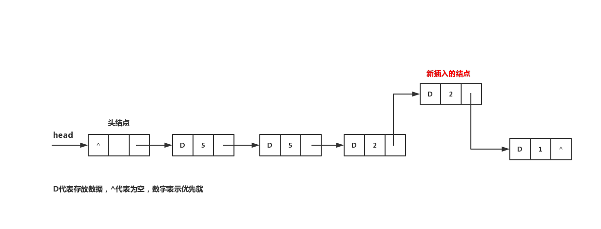

## 优先队列
队列是一种先进先出（FIFO）的数据结构，就如同现实生活中的排队一样。但即使是人人都遵守秩序，也不一定完全符合先进先出的规律。比如挂号挂诊时，军人的优先级就比较高，可以比大多数人先完成挂号并离开。

在上面的叙述中，**优先级**是一个无比重要的关键词，它引出了优先队列的概念：

> 在优先队列中，每个元素都将拥有一定的优先级。在优先级相同的元素之间依然满足FIFO，而当优先级不同时则让高优先级的元素先出队。

## 线性优先队列
优先队列依然可以使用线性结构来实现，例如链表，不过每个结点需要拥有一个表示优先级的属性：
```java
public class LinearPriorityQueue<E> {
    private class Node<T> {
        private T data;
        private Node<T> next;
        private int priority; // 元素的优先级
    }
    private Node<E> head;     // 头结点，不存放数据
    private int size;         // 优先队列的大小

    public LinearPriorityQueue() {
        head = new Node<E>();
        size=0;
    }
    public int size() { // 队列的大小
        return this.size;
    }
    public boolean isEmpty() { // 队列是否为空
        return head.next==null?true:false;
    }

    // ...优先队列的相关操作...
}
```
结点类`Node`作为内部类存在于`LinearPriorityQueue类`中。

当增加结点时，除了数据以外还需要传入结点的优先级。我在这里规定-1表示最低优先级，凡是优先级传入负数的，都处理为-1。
```java
public void add(E e, int priority) {
    //1 队列大小增1
    size++;

    //2 重置优先级大小
    if (priority<-1) priority=-1;
    
    //3 创建新的结点并设置数据与优先级
    Node<E> newNode = new Node<>();
    newNode.data = e;
    newNode.priority = priority;
    
    //4 寻找合适的位置并插入
    Node<E> p = head;
    Node<E> q = null;
    while(p.next!=null) {
        q = p;
        p = p.next;
        if (newNode.priority > p.priority) {
            q.next = newNode;
            newNode.next = p;
            return;
        }
    }
    p.next = newNode;
}
```
可以认为入队时优先级默认为-1：
```java
public void add(E e) {
    add(e, -1);
}
```

整个队列都保持着：
1. 优先级越高的结点越靠前
2. 在 **[1.]** 的前提下，越先插入的结点越靠前



由于在插入时队列就保持着一定的结构，所以当元素要出队时，越**靠前**的元素越先出队即可。
```java
public E remove() {
    size--;
    
    Node<E> p = head.next;
    
    if (p != null) {
        head.next = p.next;
        p.next = null;
        return p.data;
    }
    return null;
}
```

当然也可以规定将某个优先级的元素出队。实际上更准确的意思是，给定一个优先级priority，将满足以下所有条件的结点出队：
1. 该结点优先级小于等于priority
2. 在 **[1.]** 的前提下，该结点的优先级要最接近于priority
3. 在 **[2.]** 的前提下，该结点是最先入队的
```java
public E remove(int priority) {
    size--;
    if (priority<-1) priority=-1;
    
    Node<E> p = head;
    Node<E> q = null;
    while (p.next!=null) {
        q = p;
        p = p.next;
        if (p.priority<=priority) {
            q.next = p.next;
            p.next = null;
            return p.data;
        }
    }
    return null;
}
```

这种情况下，我们可以将一个优先队列按照**优先级**进行分组，每一组都是一个优先级相同的普通队列。