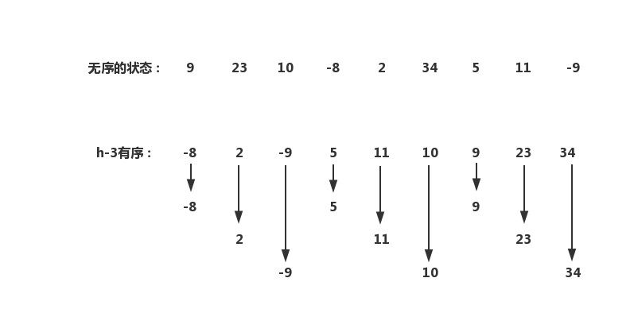

## 希尔排序

假设我们的目的并不是让整个数组有序，而是要求任意数组中任意间隔为h的元素都是有序的：



```java
public class ShellSort {
	public static <T extends Comparable<T>> void sort(T[] a) {
        int h = 5;
        
        while (h>=1) {
            for (int i = 0; i<a.length-h; i++) {
                for (int j = i+h; j>h-1; j-=h) {
                    if (SortUtil.less(a[j], a[j-h]))
                        SortUtil.swap(a, j-h, j);
					else break;
                }
            }
            h/=2;
        }
    }
    
    public static void main(String[] args) {
        Integer[] a = new Integer[] {1,2,34,1,435,76,-4};
        sort(a);
        SortUtil.show(a);
    }
}
```


#