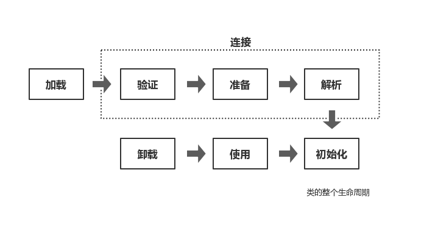

## 类加载的过程

一个类的全部生命周期可以用7个阶段表示：**加载、验证、准备、解析、初始化、使用、卸载**。其中**验证、准备、解析统称为连接**，而**类加载则有加载、连接、初始化这三个过程组成**。

下面主要讲一下类加载过程，即 **加载+连接+初始化** 。

## 加载

## 连接

### 验证

### 准备

### 解析

## 初始化

## 何时进行初始化？

## 类的被动引用

