## 寻找宝箱的钥匙
假设我们拥有一个存有宝物的箱子，但遗憾的是这个箱子上有四把锁并且我们连一把钥匙都没有！好在我们还是打听到了一些消息的：
- 四把钥匙被藏在了四个不同的地方
- 第一把钥匙被藏在了地点A
- 每把钥匙旁边还放着一张纸条，上面写着下一把钥匙的地点位置

首先来到了地点A，第一个位置从一开始就打听好了，没有什么困难


在地点A我们发现了一张纸条，他告诉我们下一把钥匙在地点B。既然知道了钥匙的位置，那么目标也就很明确了（或许只有在路上会遇上什么奇奇怪怪的事情吧）

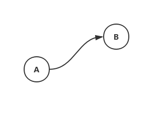

如同从A到B一样，我们在地点B知道了下一把钥匙在地点C，又在地点C知道了最后一把钥匙就在地点D

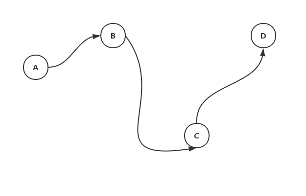

## 线性单链表
线性单链表由一系列结点组成，每个结点都由**数据域**和**一个指针**所构成，该指针指向另一个结点（最后一个结点的指针为空指针）。

一个结点就是一个地点，里面藏有钥匙 **（数据）** 和写明下一个地点的纸条 **（指针）** ：

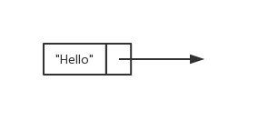

用一个Java类来定义链表的结点：
```java
public class Node<T> {
    private T data; // 数据
    private Node next; // 指向下一个结点的指针（或者说是引用）
}
```
当多个结点链接起来就形成了链表
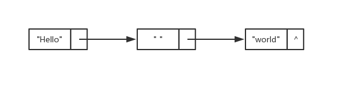
（`^`表示空指针的意思）

在实现单向链表类`SinglyLinkedList`时，完全可以将结点类`Node`作为内部类:
```java
public class SinglyLinkedList<E> {
    private class Node<T> {
        private T data;
        private Node<T> next;
    }
    
    private Node<E> head; //头结点
    private int size; //链表长度

    public SinglyLinkedList() {
        this.head = new Node<E>();
        size=0;
    }

    // ... 单链表的相关操作
}
```
在链表中，将第一个结点称为头结点。头结点的数据域可以使用，也可以不作使用。当不使用头结点的数据域时，头结点的索引就是-1了，而长度则不会算上头结点：

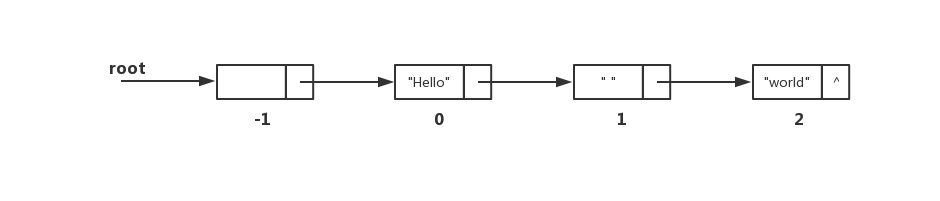

（后面的操作都不会使用头结点的数据域）

### 查找操作
定义如下的API用于线性单链表的查找操作：
```java
/**
  * 在链表中获取给定索引所对应的元素，注意头结点的索引为-1
  * @param i 给定的索引
  * @return 返回要访问的数据
  */
public E get(int i);
```
链表不可以像数组一样直接访问任意位置的元素，我们可以定义一个计数器index，然后从头结点开始依次访问每个元素，每访问一个元素则计数器就加1。如果index的初始值为-1，则当`index==i`为true时，访问的元素正好是我们想要查询的元素。

```java
public E get(int i) {
    int index = -1;
    Node<E> p = head;

    while (index != i) {
        p = p.next;
        index++;
    }

    return p.data;
}
```

### 修改操作
定义如下的API用于线性单链表的修改操作：
```java
/**
  * 修改给定索引所对应的元素数据
  * @param e
  * @param i 将要被修改的元素的索引
  */
public void update(E e, int i);
```
修改操作的前提是找到要被修改的元素，所以修改操作的代码实际上和查找元素操作基本无异。

```java
public void update(E e, int i) {
    int index = -1;
    Node<E> p = head;

    while (index != i) {
        p = p.next;
        index++;
    }

    p.data = e;
}
```
除了最后一句代码，其他部分与查找操作全是一样的。

### 插入操作
定义如下的API用于线性单链表的插入操作：
```java
/**
  * 向链表中指定的位置添加一个元素
  * @param e 插入链表的数据
  * @param i 插入位置
  */
public void add(E e, int i)
```
现在有一位处于上帝视角的神秘人对宝箱又加了一把锁，并把相应的钥匙放在了地点E。他希望寻找钥匙的人必须按照`A->E->B`的路线前行，那么他就还要做这么几件事：

1. 在地点E放上一张纸条，纸条上的地点指向了地点B
2. 把地点A的纸条内容改成地点E（这张纸条本来是写着地点B的）

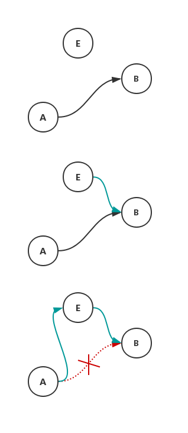

链表中的插入操作也对应有这些过程：
```java
public void add(E e, int i) {
    //1 创建一个待插入的新结点
    Node<E> newNode = new Node<>();
    newNode.data = e;

    //2 寻找到待插入的位置
    int index = -1;
    Node<E> p = head;
    Node<E> q = null; 
    while (index != i) {
        q = p;
        p = p.next;
        index++;
    }

    //3 此时p指向待插入位置的旧结点，而q指向前一个结点
    
    //4 进行插入操作
    newNode.next = p;
    q.next = newNode;

    //5 链表长度增加一
    size++;
}
```
### 删除操作
删除操作与插入操作是类似的，整体的步骤大致如下：
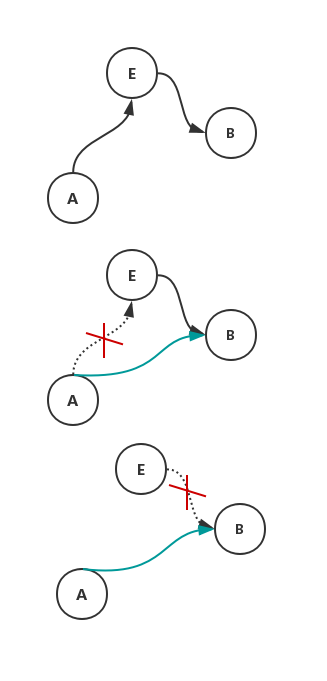

```java
public boolean remove(Object o) {
    Node<E> p = head;
    Node<E> q = null;
    while (p.next != null) {
        q = p;
        p = p.next;
        if (p.data.equals(o)) {
            q.next = p.next;
            p.next = null;
            size--;
            return true;
        }
    }
    return false;
}
```

## 线性双向链表
在线性单链表中，所有结点只保存着一个指针，所以任意结点只能访问其后继结点，而无法访问其前驱结点。我们可以让每个结点的指针域包含两个指针，一个指向前驱，一个指向后继。

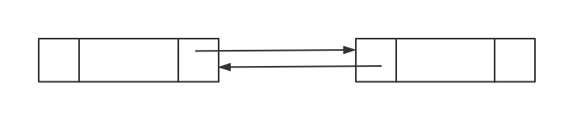

```java
public class DoubleLinkedList<E> {
    private class Node<T> {
        private Node<T> pre; //前驱
        private Node<T> next; //后继
        private T data; //数据
    }

    private Node<E> head;
    private int size;
}
```

## 非线性链表
在前面的链表中，相邻结点之间是一一对应的，即一个结点只会有一个前驱和一个后继，这被称为线性关系。

正是因为这样，我们寻找宝箱钥匙十分容易。然而事实总是残酷的，我们在找到一把钥匙后，未必能明确下面该去哪里找钥匙：
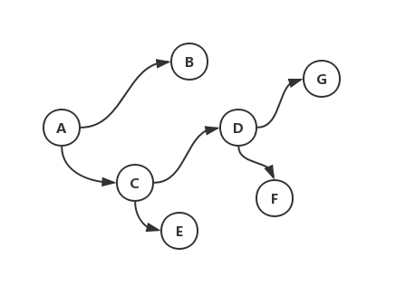

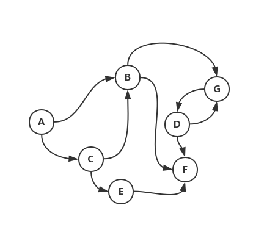

向上面这种，一个结点指向多个结点的链表，则被称为非线性链表。

## 循环单链表
另外一种单链表的衍生就是循环单链表了（自然也就很容易想到循环双向链表）：
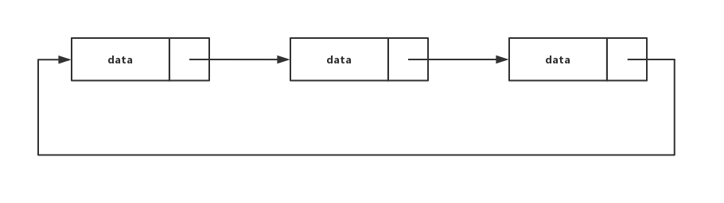